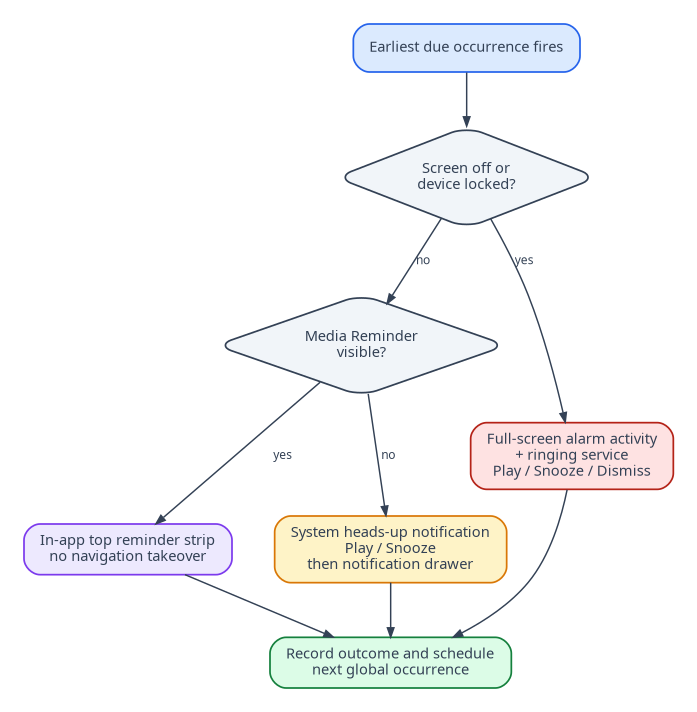

## Document control

| Field | Value |
|---|---|
| Document ID | MR-01 |
| Version | 1.0 |
| Status | Approved baseline |
| Last updated | 2026-08-05 |
| Product owner | Mohamed Aslam Abdul |
| Package identifier | `com.aslam.mediareminder` |
| Purpose | Define why the product exists, who it serves, and the principles that constrain every design and engineering decision. |

> **Reading rule:** This pack specifies a production-oriented Android application, not a promise that third-party devices will behave identically. Where Android or an OEM controls presentation, timing, sound, or permissions, the app provides transparent status and the strongest compliant fallback.

## Document conventions

The words **MUST**, **MUST NOT**, **SHOULD**, **SHOULD NOT**, and **MAY** are normative. A requirement ID is stable once published. Requirement IDs may be retired but MUST NOT be reassigned to a different meaning.

| Term | Meaning |
|---|---|
| Reminder | A user-authored instruction that connects content, a schedule, and a presentation profile. |
| Occurrence | One calculated due instance of a reminder. |
| Alarm session | The bounded runtime state created when an occurrence is actively alerting. |
| Media asset | An app-owned local video, audio, image, or text item. |
| Profile | Reusable alert behavior such as Gentle, Standard, or Persistent. |
| Exact-alarm access | Android special app access that allows exact scheduling where the platform requires it. |
| Full-screen intent | Android notification mechanism for urgent, time-sensitive activity presentation. It is not a general overlay. |
| Heads-up notification | System-rendered high-priority notification shown temporarily over the current app when Android permits it. |
| Source of truth | The authoritative specification or local persisted record for a decision or state. |

# Vision

**Nudgio helps people remember meaningful actions by presenting the right local media at the right time without demanding cloud access, constant background execution, or an unnecessary interruption.**

The originating use case is personal Islamic remembrance: a person saves useful videos about duas and adhkar, imports them, and schedules them as timely prompts. The product deliberately generalizes the engine so the same respectful interaction can support study, practice, routines and other personal goals without weakening the original need.

# Problem statement

Conventional alarm applications are reliable but content-poor. Social feeds contain memorable audio-visual reminders but are unpredictable, distracting, network-dependent and optimized for continued consumption. Calendar notifications are compact but rarely provide the media context that helps a person remember what to do. A user therefore needs a private bridge between local content and system-grade reminder behavior.

The most important problem is not merely “play a video at a time.” It is to do so while respecting three competing needs:

- **reliability:** a due reminder should be scheduled by Android and survive normal app process death;
- **attention proportionality:** a locked phone may need an alarm surface, while an actively used phone should not be hijacked;
- **efficiency and privacy:** the app should sleep while idle, store everything locally and avoid broad permissions.

# Target users

## Primary persona: purposeful reminder user

A person who already has short local videos, audio or images that reinforce a personal practice. They want simple scheduling, custom snooze, clear completion, and confidence that the app is not uploading their library.

## Secondary persona: routine learner

A student or language learner who attaches a short demonstration, pronunciation clip or explanation to a recurring reminder. They value categories, multiple schedules, quiet profiles and fast playback.

## Secondary persona: privacy-conscious organizer

A person who avoids cloud accounts and wants a portable offline archive when changing phones. They need a transparent export, validation before restore and no vendor lock-in.

## Portfolio evaluator

A recruiter, engineer or collaborator who evaluates the project as evidence of native Android integration, offline architecture, local data integrity, accessible mobile UX and battery-aware engineering. Portfolio presentation MUST remain secondary to user safety and product correctness.

# Jobs to be done

| Situation | Job | Desired outcome |
|---|---|---|
| I find a useful reminder video | Preserve it in a focused library | I can find and schedule it without returning to a social feed |
| I need a reminder at a meaningful time | Attach content and recurrence | Android presents it with appropriate urgency |
| I am actively using my phone | Avoid a forced screen takeover | I receive a compact actionable alert |
| My phone is locked | Make the due event unmistakable | The screen may wake into an alarm surface with clear actions |
| I change devices | Carry my configuration | A validated ZIP restores supported data and media offline |
| I am worried about battery | Avoid constant background work | The app remains dormant except for user actions and scheduled events |

# Product principles

## 1. Calm before clever

The interface MUST feel intentional, not gamified. It uses plain language, restrained motion and no guilt-inducing streaks. A missed reminder is information, not a moral judgment.

## 2. System-compliant reliability

The app uses Android's alarm and notification mechanisms rather than fighting the operating system. It MUST disclose when exact-alarm access, notification permission, channel importance, full-screen eligibility, device state or OEM restrictions reduce behavior.

## 3. Interruption follows context

Full-screen presentation is reserved for a locked or non-interactive device. An unlocked device receives a system heads-up notification. The app MUST NOT use `SYSTEM_ALERT_WINDOW` to simulate an arbitrary 20%-height overlay over other apps.

## 4. Local means local

Core functionality works in airplane mode. The production manifest contains no Internet permission. Media is copied into app-owned storage so later gallery deletion does not silently break a reminder.

## 5. Battery is a feature

No always-running JavaScript timer, periodic polling loop or idle foreground service. The scheduler holds one next due alarm, wakes briefly, reschedules and returns to idle. Battery claims are verified with measurements, not inferred from architecture alone.

## 6. Portability without pretending

Backups carry logical app data and media, not operating-system grants or device-specific paths. Import MUST preview what can and cannot be restored, validate every checksum and commit atomically.

## 7. User action remains sovereign

The user can snooze, dismiss or play. Video begins only after Play. Profiles may make alert sound persistent, but the app MUST always expose a clear stop path and a finite automatic timeout.

## 8. Inclusive by default

TalkBack labels, keyboard/switch access, 200% font scaling, high contrast, reduced motion and RTL-safe layout are product requirements, not later polish.

# Goals

| Goal ID | Goal | Indicator |
|---|---|---|
| G-01 | Make local media schedulable as respectful reminders | A first-time user imports and schedules a reminder without documentation |
| G-02 | Deliver state-adaptive alert presentation | Locked and unlocked test scenarios select different surfaces correctly |
| G-03 | Remain offline and private | No network permission; no request leaves the app in static and runtime inspection |
| G-04 | Remain battery-efficient while idle | No resident service or periodic wake loop; measured idle delta remains inside MR-15 budget |
| G-05 | Make device migration trustworthy | Export/import round trip preserves supported records and file hashes |
| G-06 | Demonstrate professional engineering | Tagged releases include documentation, tests, SBOM, signing and reproducible evidence |

# Non-goals

Version 1 does not provide:

- cloud accounts, cloud sync, remote backup or multi-device real-time state;
- iOS, desktop, Wear OS, Android Auto or web clients;
- downloaded social-media content acquisition or copyright circumvention;
- automatic prayer times, religious rulings, Quran content certification or built-in theological content;
- emergency alerts, medication adherence guarantees, life-critical scheduling or legal compliance claims;
- GPS, geofences, Bluetooth triggers, sensor-based habits or AI-generated reminder advice;
- public sharing, social feeds, leaderboards, streak pressure or advertising;
- arbitrary overlays over other apps;
- exact restoration of Android notification channels, permissions, alarm tones or OEM battery policy.

# Ethical use statement

Users are responsible for the media they import and the contexts in which alerts play. The app SHOULD remind them to respect copyright, privacy, prayer, meetings, driving and shared spaces. It MUST avoid shipping copyrighted social clips as demo content. The reference starter library, if created, MUST use owned, licensed or public-domain media with documented provenance.

# Success horizon

## First-use success

A new user can understand the product, grant only the permissions needed for a chosen behavior, import media, create a daily reminder and test the alert. Permission education occurs at the moment of need, not as an undifferentiated startup wall.

## Thirty-day success

The app remains installed, reminders continue after normal process death and reboot, the library stays intact, and the user can identify any degraded system permission from the Health screen.

## Migration success

A person exports on one device, transfers the ZIP using any file-sharing method they choose, imports on another supported device, reviews conflicts and restores. The app then guides them through regranting device-owned permissions before enabling exact reminders.

# Charter constraints

The team MUST treat the following as release blockers:

- a full-screen activity appears while the device is unlocked and another app is in active use;
- an alert cannot be silenced because the React Native runtime failed to initialize;
- imported media can escape app storage or be overwritten without a transaction record;
- a malformed ZIP can write outside the staging directory;
- the scheduler duplicates an occurrence after reboot or timezone change;
- the app is idle with a persistent foreground service;
- the product claims a fixed heads-up height or guaranteed exact delivery across Android devices;
- destructive import proceeds without a preview and explicit confirmation.

# Ownership and decision rights

The product owner approves scope, brand and release priorities. The Android reliability owner has veto authority over changes that weaken alarm action availability, data integrity, permission compliance or battery behavior. UX can choose presentation within platform constraints but cannot replace a system-owned heads-up notification with overlay permission. Backup format changes require architecture, QA and security review.

# Brand direction

The product brand is **Nudgio**. The product should convey **calm, intentional and dependable**. Islamic remembrance is the lead authentic use case in narrative and screenshots where appropriate, while the core product language remains inclusive of other lawful personal reminder uses.

---

## Governance

This document is part of the **Nudgio Source-of-Truth Pack v1.0**. In case of conflict, apply this precedence order: (1) explicit platform safety and permission rules, (2) Architecture Decision Records, (3) Android specification, (4) data and backup specifications, (5) PRD and feature specification, (6) UX and visual guidance, (7) implementation notes. Record any intentional deviation in the decision log before release.

