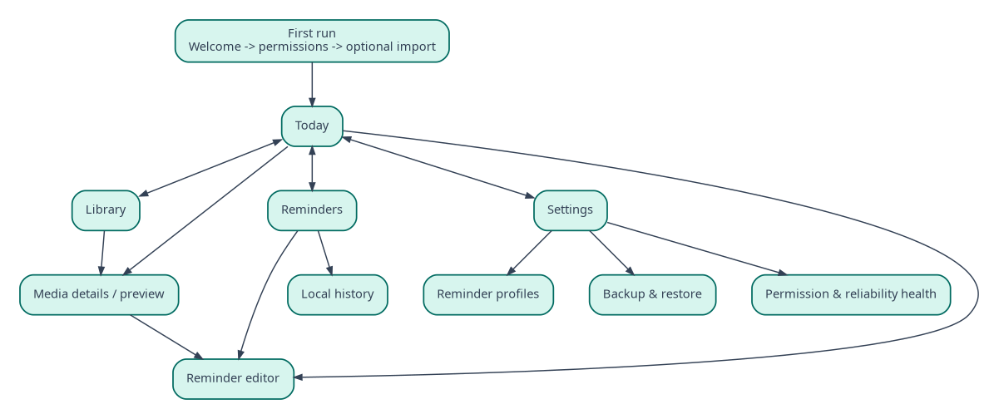

## Document control

| Field | Value |
|---|---|
| Document ID | MR-02 |
| Version | 1.0 |
| Status | Approved baseline |
| Last updated | 2026-08-05 |
| Product owner | Mohamed Aslam Abdul |
| Package identifier | `com.aslam.mediareminder` |
| Purpose | Specify product outcomes, release scope, user stories, functional and non-functional requirements, and acceptance criteria. |

> **Reading rule:** This pack specifies a production-oriented Android application, not a promise that third-party devices will behave identically. Where Android or an OEM controls presentation, timing, sound, or permissions, the app provides transparent status and the strongest compliant fallback.

## Document conventions

The words **MUST**, **MUST NOT**, **SHOULD**, **SHOULD NOT**, and **MAY** are normative. A requirement ID is stable once published. Requirement IDs may be retired but MUST NOT be reassigned to a different meaning.

| Term | Meaning |
|---|---|
| Reminder | A user-authored instruction that connects content, a schedule, and a presentation profile. |
| Occurrence | One calculated due instance of a reminder. |
| Alarm session | The bounded runtime state created when an occurrence is actively alerting. |
| Media asset | An app-owned local video, audio, image, or text item. |
| Profile | Reusable alert behavior such as Gentle, Standard, or Persistent. |
| Exact-alarm access | Android special app access that allows exact scheduling where the platform requires it. |
| Full-screen intent | Android notification mechanism for urgent, time-sensitive activity presentation. It is not a general overlay. |
| Heads-up notification | System-rendered high-priority notification shown temporarily over the current app when Android permits it. |
| Source of truth | The authoritative specification or local persisted record for a decision or state. |

# Product overview

Nudgio is a local Android application that connects imported content to recurring or one-time schedules. It adapts presentation to device state, stores all content on-device, supports portable ZIP backup, and uses system scheduling rather than permanent background execution.

# Release scope

## P0 - public MVP

- import local video, audio and image files using Android Photo Picker or Storage Access Framework;
- create app-owned media records with title, optional notes, category and tags;
- create, edit, enable, disable and delete one-time, daily and weekly reminders;
- assign one of three reusable profiles: Gentle, Standard or Persistent;
- configurable snooze presets and a bounded custom snooze;
- locked/non-interactive full-screen alarm path where eligible;
- unlocked heads-up notification with Play, Snooze and Dismiss actions;
- foreground in-app reminder strip;
- local video/audio/image playback after Play;
- boot and app-update rescheduling;
- timezone and wall-clock change reconciliation;
- versioned ZIP export and import with preview, validation, merge or replace;
- Settings Health screen for notification permission, exact alarms, channels and full-screen eligibility;
- light, dark and system theme; TalkBack; dynamic text; reduced motion;
- signed APK release, privacy notice and diagnostic export without personal media.

## P1 - post-MVP

- text cards as a first-class asset type;
- advanced recurrence including monthly day rules and interval rules;
- optional local completion history dashboard;
- duplicate detection by content hash before copying;
- user-created profiles beyond the three defaults;
- backup encryption with a user-supplied passphrase;
- home-screen widget and quick-add shortcut;
- localization for Tamil and Arabic after string externalization and RTL validation.

## P2 - exploratory

- playlists or random media pools;
- Wear OS companion;
- optional user-operated cloud file target without an app backend;
- prayer-time plugin supplied as a separate, clearly scoped module;
- iOS feasibility study with documented scheduling differences.

# Primary user journey

1. User opens the app and sees a concise explanation of local-only operation.
2. User imports a media file through a system picker.
3. App copies the selected stream to a pending file, hashes it, validates type/size, atomically promotes it and creates the database record.
4. User opens the asset, selects **Add reminder**, chooses a time, repeat rule, profile and snooze behavior.
5. App saves the intent, calculates the next occurrence and schedules the global next Android alarm.
6. At due time, native code decides the presentation from lock and interactive state.
7. User selects Play, Snooze or Dismiss without depending on JavaScript startup.
8. App records the outcome locally, calculates the next occurrence and returns to idle.
9. User may export a portable archive and restore it on a new device.

# Product requirements

## Core and privacy

- **PRD-001:** The production app MUST complete all core functions with airplane mode enabled.
- **PRD-002:** The production manifest MUST NOT declare `android.permission.INTERNET`.
- **PRD-003:** The app MUST NOT require an account, email address, phone number, analytics consent or cloud service.
- **PRD-004:** The app MUST explain that imported media is copied to private app storage and that uninstalling the app removes that app-owned copy unless backed up.
- **PRD-005:** User-facing reliability language MUST describe platform limitations and MUST NOT promise guaranteed delivery.

## Media library

- **PRD-010:** A user MUST be able to import supported video, audio and image formats through system-owned pickers.
- **PRD-011:** A successful import MUST remain playable if the original gallery item is later deleted.
- **PRD-012:** A user MUST be able to rename, categorize, tag, preview and delete an asset.
- **PRD-013:** Deleting an asset used by reminders MUST require a choice to cancel, delete dependent reminders, or detach them into a disabled missing-media state.
- **PRD-014:** Unsupported, corrupt, oversized or insufficient-storage imports MUST fail safely without a partial library record.

## Reminder authoring

- **PRD-020:** A reminder MUST combine one content item, one schedule rule, one profile and user-visible label information.
- **PRD-021:** MVP scheduling MUST support one-time, daily and selected weekdays.
- **PRD-022:** A user MUST be able to enable, disable, duplicate and delete a reminder.
- **PRD-023:** The editor MUST show the next calculated occurrence before Save.
- **PRD-024:** Invalid or nonexistent local times MUST be explained and resolved deterministically under MR-06.
- **PRD-025:** No reminder is treated as reliably active until required system capabilities are present or the user explicitly accepts Limited mode.

## Alert behavior

- **PRD-030:** When the device is locked or non-interactive, an eligible due occurrence MAY wake a native full-screen alarm activity.
- **PRD-031:** When the device is unlocked and interactive, a due occurrence MUST NOT launch a full-screen activity over the current app; it MUST use a system heads-up notification when available.
- **PRD-032:** The app MUST NOT request overlay permission for reminder presentation.
- **PRD-033:** Play, Snooze and Dismiss MUST function from the notification or native alarm activity without waiting for React Native initialization.
- **PRD-034:** Attached media MUST begin only after the user selects Play.
- **PRD-035:** Every ringing path MUST have a finite timeout and an immediately reachable stop action.
- **PRD-036:** Android or OEM control of heads-up layout MUST be disclosed; the app MUST not promise exact screen-height coverage.

## Battery and resilience

- **PRD-040:** Idle operation MUST use no resident foreground service, wake lock, JavaScript interval or periodic worker solely to monitor time.
- **PRD-041:** The scheduler MUST maintain one next due one-shot system alarm and recalculate after changes.
- **PRD-042:** Alarms MUST be reconciled after supported reboot, app update, timezone and clock-change broadcasts.
- **PRD-043:** An exact-alarm-denied state MUST be visible and actionable.
- **PRD-044:** Force-stop consequences MUST be explained in Health because Android prevents app wake until the user relaunches it.

## Backup and migration

- **PRD-050:** Export MUST create a local, versioned ZIP with logical JSON data, media and checksums.
- **PRD-051:** Export MUST exclude raw database files, caches, thumbnails, device paths, permission grants and notification channel state.
- **PRD-052:** Import MUST validate archive structure, uncompressed limits, path safety, schema, references, hashes and available storage before commit.
- **PRD-053:** Import MUST support Inspect only, Merge and Replace modes.
- **PRD-054:** Replace MUST create a rollback snapshot or equivalent transactional recovery before destructive commit.
- **PRD-055:** Restored reminders MUST remain disabled until necessary device-owned capabilities are re-evaluated and the user confirms activation.

## Accessibility

- **PRD-060:** All functions MUST be operable with TalkBack and switch access.
- **PRD-061:** Text MUST remain usable at 200% font scaling without clipping critical actions.
- **PRD-062:** Color MUST NOT be the only state indicator.
- **PRD-063:** Reduced-motion preference MUST remove nonessential movement.
- **PRD-064:** Alarm actions MUST use clear verbs, large targets and differentiated semantics.

# User stories and acceptance

| Story | Acceptance summary |
|---|---|
| As a user, I import a downloaded dua video | Picker opens; selected bytes are copied, hashed and previewable offline; original deletion does not break playback |
| As a user, I schedule Morning Adhkar daily | Editor shows next time; reminder persists; one system alarm is recalculated; due event appears appropriately |
| As a user actively browsing another app | No full-screen takeover occurs; a heads-up notification offers Play, Snooze and Dismiss |
| As a user with a locked phone | Screen may wake to a native alarm surface; buttons work before RN is ready; media waits for Play |
| As a user changing phones | Export creates a shareable ZIP; new device previews, validates and imports; permissions are re-requested separately |
| As a privacy-conscious user | Runtime inspection shows no network traffic and the manifest lacks Internet permission |
| As a battery-conscious user | Idle measurement shows no persistent service and no repetitive wake schedule |

# Information architecture

The primary navigation is **Today**, **Library**, **Reminders**, and **Settings**. The central creation action opens a sheet offering Import media or Create reminder. Health and Backup are first-level settings destinations because reliability and portability are primary product concepts, not hidden utilities.

# Business and portfolio requirements

The project has no monetization requirement for v1. It MAY accept open-source contributions and sponsorship later, but no monetization path may introduce tracking or degrade offline operation without a new product decision.

The public portfolio page SHOULD include:

- a privacy-safe product narrative based on the genuine problem;
- adaptive alert behavior diagram;
- architecture diagram and battery strategy;
- APK download linked to a signed GitHub release;
- source repository, release notes and SHA-256 checksum;
- screenshots using synthetic or owned media;
- a limitations section that accurately states Android dependencies.

# Product metrics

Metrics are local or release-process measurements; no telemetry is uploaded.

| Metric | MVP target |
|---|---|
| First reminder task completion in moderated usability test | At least 5 of 6 participants without facilitator correction |
| Successful locked/unlocked presentation decision | 100% across required scripted scenarios |
| Alarm action availability without RN startup | 100% in native instrumentation tests |
| Export/import logical and hash round trip | 100% for supported fixtures |
| Critical accessibility task completion | 100% with TalkBack test script |
| Idle persistent services | 0 |
| Open P0 defects at release | 0 |

# Dependencies and risks

The product depends on Android permission and notification policy, OEM behavior, local file codecs, and the user's device settings. The largest product risks are expectation mismatch around “exact,” misuse of full-screen intents, notification channels changed by the user, force-stop behavior, large backup archives, and native/JavaScript state divergence. Each has a dedicated mitigation in MR-06, MR-10 and MR-11.

# Exit criteria

MVP exits development only when all P0 requirements are traceably tested, no data-loss path remains unresolved, adaptive presentation is verified on physical devices, exported archives restore after clean install, and idle battery evidence meets MR-15. A visually polished demo without these conditions is not an acceptable release.

---

## Governance

This document is part of the **Nudgio Source-of-Truth Pack v1.0**. In case of conflict, apply this precedence order: (1) explicit platform safety and permission rules, (2) Architecture Decision Records, (3) Android specification, (4) data and backup specifications, (5) PRD and feature specification, (6) UX and visual guidance, (7) implementation notes. Record any intentional deviation in the decision log before release.

