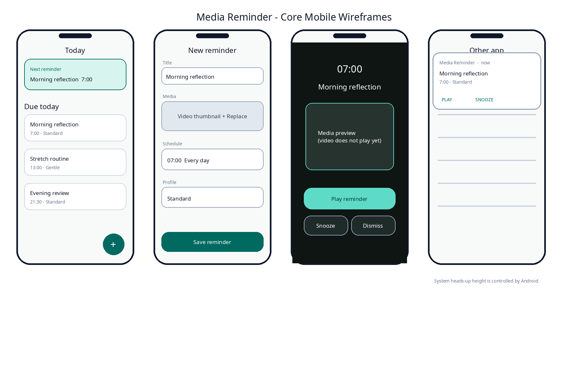

## Document control

| Field | Value |
|---|---|
| Document ID | MR-03 |
| Version | 1.0 |
| Status | Approved baseline |
| Last updated | 2026-08-05 |
| Product owner | Mohamed Aslam Abdul |
| Package identifier | `com.aslam.mediareminder` |
| Purpose | Define every primary screen, state, flow, action, message, transition and device-adaptive alarm interaction. |

> **Reading rule:** This pack specifies a production-oriented Android application, not a promise that third-party devices will behave identically. Where Android or an OEM controls presentation, timing, sound, or permissions, the app provides transparent status and the strongest compliant fallback.

## Document conventions

The words **MUST**, **MUST NOT**, **SHOULD**, **SHOULD NOT**, and **MAY** are normative. A requirement ID is stable once published. Requirement IDs may be retired but MUST NOT be reassigned to a different meaning.

| Term | Meaning |
|---|---|
| Reminder | A user-authored instruction that connects content, a schedule, and a presentation profile. |
| Occurrence | One calculated due instance of a reminder. |
| Alarm session | The bounded runtime state created when an occurrence is actively alerting. |
| Media asset | An app-owned local video, audio, image, or text item. |
| Profile | Reusable alert behavior such as Gentle, Standard, or Persistent. |
| Exact-alarm access | Android special app access that allows exact scheduling where the platform requires it. |
| Full-screen intent | Android notification mechanism for urgent, time-sensitive activity presentation. It is not a general overlay. |
| Heads-up notification | System-rendered high-priority notification shown temporarily over the current app when Android permits it. |
| Source of truth | The authoritative specification or local persisted record for a decision or state. |

# Experience goals

The experience should feel calm, predictable and respectful. The app must be understandable without technical Android knowledge while still exposing the health of platform capabilities. It separates **content**, **schedule**, and **alert behavior** so users can reuse the same profile and media without duplicating settings.

# Navigation model

The bottom navigation contains four destinations:

- **Today** - next due reminders, recent outcomes and capability warnings that affect today;
- **Library** - imported media, categories, tags and storage use;
- **Reminders** - all schedules with enable state and next occurrence;
- **Settings** - Health, profiles, defaults, backup, appearance, accessibility, privacy and About.

A floating action button labeled **Add** opens a modal action sheet with **Import media**, **Create reminder**, and **Create text card** when text assets are enabled. Back navigation follows Android conventions; unsaved editors show a discard confirmation only when meaningful changes exist.

# Onboarding

## Page 1 - purpose

Title: **Make local media useful at the right moment**  
Body: “Import videos, audio or images and schedule them as private reminders. Nothing is uploaded.”  
Primary: **Continue**  
Secondary: **View privacy details**

## Page 2 - adaptive behavior

Use a simple locked/unlocked illustration. Copy: “When your phone is locked, a reminder can open like an alarm. While you are using your phone, Android shows a compact notification instead.” Avoid promising exact dimensions.

## Page 3 - permissions by intent

Onboarding does not immediately request every permission. It explains that:

- notification permission is requested before creating the first active reminder;
- exact-alarm access is requested only after the user chooses exact timing;
- media access uses a system picker and does not grant the app the whole gallery;
- full-screen eligibility is checked when the user selects a profile that uses locked-screen alarm presentation.

Primary: **Start with my library**. The user can skip setup and explore with a demo text card.

# Today screen

## Normal state

Top area shows greeting-neutral copy: **Today** and date. A status chip shows **Ready**, **Action needed**, or **Limited timing**. The first card is **Next reminder** with content thumbnail, name, due time, repeat summary and actions: Play preview, Edit, More.

Below is a chronological list of today's occurrences. Each row has time, label, media icon, profile icon and state: Upcoming, Snoozed, Completed, Dismissed, Missed, Disabled or Needs setup. Completed and dismissed are factual, not celebratory or shaming.

## Empty state

Title: **No reminders scheduled**  
Body: “Import something meaningful, then choose when it should return.”  
Primary: **Import media**  
Secondary: **Create reminder from a text card**

## Capability warning

A single high-salience card appears only for a condition that affects active reminders. Example: **Exact timing is off**. Body explains the consequence. Primary opens Health. It never blocks browsing the library.

# Library

The default presentation is a two-column grid on typical phones and adaptive columns on wider displays. Each card shows thumbnail, title, duration/type, number of active reminders and overflow menu.

Controls:

- search field with local title/category/tag search;
- filter chips for Videos, Audio, Images, Text and Missing;
- category chip row;
- sort by Recently added, Name, Most scheduled or File size;
- selection mode for batch category/tag/export/delete operations.

## Import flow

1. User selects **Import media**.
2. App opens Photo Picker for supported visual media or the document picker for audio and general files.
3. A progress sheet reports `Copying`, `Checking`, `Creating preview`, and `Ready`.
4. The sheet can be dismissed only when background-safe copying is implemented; MVP keeps it modal with Cancel while the stream is open.
5. On success, the details editor opens with detected title and editable metadata.

Error copy states the cause and preserves user control:

- “This file type is not supported.”
- “The file could not be read. It may have moved or be damaged.”
- “Not enough free space. Free at least 420 MB and try again.”
- “Import was cancelled. No file was added.”

A duplicate hash prompts **Use existing**, **Import another copy**, or **Cancel** when P1 duplicate detection is active.

# Media detail

The detail screen includes preview, title, type/duration/size, category, tags, notes, attached reminders and file integrity status. Primary action is **Add reminder**. Secondary actions: Play preview, Edit details, Export this item, Delete.

Deleting shows dependency-aware copy: “This media is used by 3 reminders.” Options are **Cancel**, **Keep reminders disabled**, and **Delete media and reminders**. The destructive button is last and colored as an error action.

# Reminder editor

The editor is a single scrollable form with progressive disclosure:

1. **What** - selected media with Change action;
2. **When** - date/time and repeat choice;
3. **Alert style** - profile card with concise behavior summary;
4. **Snooze** - default duration and allowed custom range;
5. **Options** - label, notes, auto-timeout and history toggle;
6. **Preview** - “Next: Thursday, 6 August at 6:15 AM”; capability summary;
7. **Save reminder**.

The Save button is enabled only when data is structurally valid. A capability problem does not erase work. Instead Save creates the reminder disabled or Limited according to explicit user choice.

## Repeat editor

MVP options: Once, Every day, Selected days. The weekday row uses localized first-day-of-week ordering. Date and time are separate controls. The screen reads the resulting rule in plain language.

For a local time that does not exist because of a daylight-saving transition, show: “2:30 AM does not occur on this date. The reminder will use 3:00 AM.” The user can accept or select another time. For an ambiguous repeated local time, default to the first occurrence and expose **Use second 1:30 AM** where the platform timezone supports it.

# Profiles

## Gentle

Best for low-urgency prompts. Unlocked: heads-up if Android permits, one short vibration, default notification sound off. Locked: notification on lock screen; no continuous ringing by default. Auto-timeout 60 seconds.

## Standard

Unlocked: heads-up with sound and short vibration. Locked: full-screen eligible with repeating vibration and alarm sound. Auto-timeout 5 minutes.

## Persistent

Unlocked: heads-up plus repeated notification escalation according to configured retry policy, but no full-screen takeover. Locked: full-screen eligible with continuous bounded alarm sound/vibration. Auto-timeout 10 minutes. The label explicitly says “Not for emergencies.”

Profile summaries state behavior rather than vague urgency words. Changes to a shared profile show the number of reminders affected.

# Due reminder presentation

## Decision

At trigger, native code samples current state once and chooses the least intrusive sufficient surface. Unknown state fails toward nonintrusive notification behavior.

| State | Surface | Sound/vibration | Notes |
|---|---|---|---|
| Device locked or keyguard showing | Full-screen alarm activity when eligible | Profile-controlled bounded alarm | May wake screen; Android may still show a notification fallback |
| Screen non-interactive | Full-screen alarm activity when eligible | Profile-controlled bounded alarm | Same as locked path |
| Unlocked and interactive | System heads-up notification | Notification or profile-controlled short alert | Never launch full screen over current app |
| Nudgio foreground | In-app top strip plus notification record | Profile-controlled; generally reduced duplication | Strip height is at most `min(144dp, 20% usable height)` |
| State cannot be determined | Heads-up/notification fallback | Standard channel behavior | Safer than surprise takeover |

Android and OEMs control whether and how a heads-up notification appears. The design target is compact, but the app does not control a precise 0.2-screen height.

## Locked-screen alarm surface

The native alarm activity uses an edge-to-edge darkened backdrop derived from a blurred/solid media theme, title, due time and three large actions:

- **Play** - stops alarm sound, marks accepted, opens native media player and begins attached media;
- **Snooze** - opens bottom sheet of configured durations; hardware volume keys may silence sound but do not dismiss;
- **Dismiss** - stops alert and records dismissed.

Media is not visible as an autoplaying video behind the controls. A static thumbnail may be shown. Controls remain reachable at 200% font scaling, in landscape and with TalkBack.

## Unlocked heads-up

Notification title: reminder label. Text: due time and media name. Actions: Play, Snooze, Dismiss. A thumbnail MAY appear if it does not displace actions. The app never asks the user to “accept the alarm”; **Play** is clearer and describes the result.

Ignoring a heads-up leaves it in the notification shade. Gentle auto-times out. Standard records Missed after timeout. Persistent may issue bounded re-alerts according to profile, but never opens full screen while unlocked.

## In-app strip

The top strip is nonmodal and pushes content only when necessary. It shows title, time, Play and Snooze. Dismiss is in overflow on small widths but remains a direct action for accessibility focus order. Swiping upward collapses it to a status chip; swiping sideways does not silently dismiss.

# Snooze interaction

Default choices are 5, 10, 15, 30 and 60 minutes, customizable globally and per reminder. Custom input is constrained to 1 minute through 24 hours in MVP. The confirmation announces the absolute next time: **Snoozed until 6:25 AM**, not merely “10 minutes.” Multiple taps are idempotent.

A snoozed occurrence is a child occurrence tied to the original due event. It does not shift the base recurring schedule unless the user selects **Move schedule** from the reminder editor.

# Missed and overlapping reminders

When the device becomes available after an occurrence was missed:

- occurrences less than the profile grace window old may alert once;
- older occurrences appear as Missed in Today without a surprise full-screen alert;
- if several are due together, one active alarm session is shown and others are queued in chronological order;
- after action, the next queued reminder is offered as a card, not stacked full-screen activities.

# Health screen

Health is a dashboard, not a permission dump. Rows include Notifications, Exact timing, Locked-screen alarm, Notification channels, Battery/OEM notes and Last scheduler check. Each row shows Ready, Limited or Action needed, a plain-language effect and one action.

The app MUST not pretend it can read every OEM policy. Where behavior is unknowable, copy says: “Your device manufacturer may delay background alerts. Use Test reminder after changing battery settings.”

The **Test reminder** control schedules a native test 15 seconds ahead and asks the user to lock or keep the phone unlocked depending on selected scenario. It is visibly labeled as a test and does not write completion history.

# Backup UX

## Export

Screen summarizes asset count, reminders, estimated size, archive privacy and destination choice. Warning: “This ZIP contains your media and reminder names. Anyone with the file can open it.” Primary: **Choose where to save**. Progress shows files completed and bytes written. On success: filename, size, hash, **Share**, **Done**.

## Import

1. Choose ZIP using document picker.
2. **Inspecting backup** with cancel.
3. Preview version, export date, counts, size, checksum status and incompatibilities.
4. Choose Inspect only, Merge or Replace.
5. Review conflict plan.
6. Confirm. Replace requires typing `REPLACE` or a second explicit confirmation plus rollback explanation.
7. Commit, then show restored counts and required setup steps.

No reminders are silently activated until Android capabilities are checked on the new device.

# Copy style

Use concise, respectful language. Avoid “failure” when a setting is simply disabled; say what happened and what the person can do. Avoid religious claims in generic product copy. Islamic example content may use accurate names supplied by the user, but the app itself does not evaluate religious correctness.

Preferred: “Exact timing is off. Android may deliver reminders later.”  
Avoid: “Your alarm is broken.”

Preferred: “Dismiss”  
Avoid: “Skip your dua.”

# Motion and feedback

Navigation uses Material motion with 200-300 ms transitions. Alarm and notification actions respond immediately with haptic confirmation where allowed. Reduced-motion mode changes movement to crossfades or instant state changes. Import progress is determinate when byte length is known and otherwise uses a labeled indeterminate indicator.

# Error and recovery pattern

Every error view contains:

1. a human title;
2. one-sentence effect;
3. preserved-state statement when relevant;
4. primary recovery action;
5. optional technical details behind **Details**;
6. diagnostic code that contains no file name or personal label.

Example: **Could not finish import**. “The selected file became unavailable while it was being copied. No library item was created.” Actions: **Choose file again**, **Cancel**. Details: `MR-IMP-READ-004`.

---

## Governance

This document is part of the **Nudgio Source-of-Truth Pack v1.0**. In case of conflict, apply this precedence order: (1) explicit platform safety and permission rules, (2) Architecture Decision Records, (3) Android specification, (4) data and backup specifications, (5) PRD and feature specification, (6) UX and visual guidance, (7) implementation notes. Record any intentional deviation in the decision log before release.

