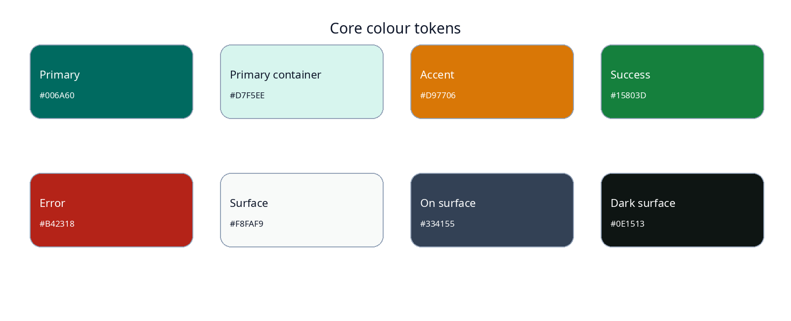

## Document control

| Field | Value |
|---|---|
| Document ID | MR-04 |
| Version | 1.0 |
| Status | Approved baseline |
| Last updated | 2026-08-05 |
| Product owner | Mohamed Aslam Abdul |
| Package identifier | `com.aslam.mediareminder` |
| Purpose | Define brand attributes, color, type, spacing, shape, components, responsive behavior, iconography, motion and visual accessibility. |

> **Reading rule:** This pack specifies a production-oriented Android application, not a promise that third-party devices will behave identically. Where Android or an OEM controls presentation, timing, sound, or permissions, the app provides transparent status and the strongest compliant fallback.

## Document conventions

The words **MUST**, **MUST NOT**, **SHOULD**, **SHOULD NOT**, and **MAY** are normative. A requirement ID is stable once published. Requirement IDs may be retired but MUST NOT be reassigned to a different meaning.

| Term | Meaning |
|---|---|
| Reminder | A user-authored instruction that connects content, a schedule, and a presentation profile. |
| Occurrence | One calculated due instance of a reminder. |
| Alarm session | The bounded runtime state created when an occurrence is actively alerting. |
| Media asset | An app-owned local video, audio, image, or text item. |
| Profile | Reusable alert behavior such as Gentle, Standard, or Persistent. |
| Exact-alarm access | Android special app access that allows exact scheduling where the platform requires it. |
| Full-screen intent | Android notification mechanism for urgent, time-sensitive activity presentation. It is not a general overlay. |
| Heads-up notification | System-rendered high-priority notification shown temporarily over the current app when Android permits it. |
| Source of truth | The authoritative specification or local persisted record for a decision or state. |

# Design intent

Nudgio should look like a quiet, modern utility rather than a loud alarm clock or generic social-media clone. The three brand attributes are **calm**, **intentional** and **dependable**. Material 3 provides the interaction foundation, while the product uses a restrained teal system, warm amber accents and generous spacing.

# Color system

All color pairings MUST meet the contrast requirements in MR-13. Dynamic color MAY be offered later but the fixed brand palette remains the default for consistent screenshots and alarm recognition.

| Token | Light | Dark | Use |
|---|---:|---:|---|
| Primary | `#006A60` | `#5EDBC8` | Primary actions, selected state, key status |
| On primary | `#FFFFFF` | `#003732` | Content on primary |
| Primary container | `#D7F5EE` | `#005047` | Low-emphasis selected cards |
| On primary container | `#00201C` | `#D7F5EE` | Text/icons on container |
| Secondary | `#D97706` | `#FFB951` | Snooze, warm attention, due-soon indicator |
| Surface | `#F8FAF9` | `#0E1513` | App background |
| Surface container | `#EEF2F0` | `#17201D` | Cards, sheets, navigation |
| On surface | `#171D1B` | `#DEE4E1` | Primary content |
| On surface variant | `#3F4946` | `#BEC9C5` | Secondary content |
| Outline | `#6F7975` | `#89938F` | Dividers, controls |
| Error | `#B42318` | `#FFB4AB` | Destructive actions, blocking errors |
| Success | `#15803D` | `#68D391` | Completed/healthy state, always with icon/text |
| Scrim | `#000000` at 48% | `#000000` at 64% | Modal and alarm backdrop |

The alarm surface uses dark tonal surfaces even when the app theme is light, reducing glare on a woken screen. Controls retain full contrast. Red is reserved for destructive action or blocking fault, not normal urgency.

# Typography

Use the Android system sans family or Noto Sans where bundled size and license are acceptable. Arabic localization uses Noto Sans Arabic or platform equivalent after glyph QA. Avoid custom display fonts that increase APK size or impair script support.

| Role | Size/line height | Weight | Typical use |
|---|---|---|---|
| Display small | 36/44 sp | 500 | Locked-screen due time on large devices |
| Headline large | 32/40 sp | 500 | Alarm title |
| Headline medium | 28/36 sp | 500 | Screen title on expanded layouts |
| Title large | 22/28 sp | 600 | Top app bar, major card |
| Title medium | 16/24 sp | 600 | List/card title |
| Body large | 16/24 sp | 400 | Primary body copy |
| Body medium | 14/20 sp | 400 | Supporting copy |
| Label large | 14/20 sp | 600 | Buttons and tabs |
| Label medium | 12/16 sp | 600 | Chips and metadata |

Use tabular figures for times where available. Do not disable system font scaling. At 200%, action labels may wrap to two lines; critical controls MUST not truncate to ambiguous text.

# Spacing and grid

The base unit is 4 dp. Common increments: 4, 8, 12, 16, 20, 24, 32 and 40 dp. Phone screen side padding is 16 dp; compact dialog padding is 24 dp; expanded layouts use a centered content max-width of 840 dp.

- Minimum touch target: 48 x 48 dp.
- Alarm primary actions: minimum 56 dp height and 64 dp preferred.
- List row: minimum 64 dp, expanding with font scale.
- Card internal padding: 16 dp.
- Section gap: 24 dp.
- Bottom navigation height: platform Material baseline plus system insets.

# Shape and elevation

| Component | Corner radius | Elevation |
|---|---:|---:|
| Small chip | 8 dp | 0 |
| Text field / compact control | 12 dp | 0 |
| Standard card | 16 dp | 0-1 |
| Dialog | 24 dp | 3 |
| Bottom sheet | 28 dp top corners | 3 |
| In-app due strip | 20 dp bottom corners | 4 |
| Alarm action button | 20 dp | 1 |

Do not use shadows as the only boundary in dark mode. Combine tonal surface, outline and elevation as needed.

# Iconography

Use Material Symbols Rounded with a consistent optical size. Every icon-only button requires an accessibility label and tooltip where supported. Core concepts:

- Play: filled play arrow;
- Snooze: alarm with plus or schedule icon plus text;
- Dismiss: close icon only when paired with visible `Dismiss` on alarm surfaces;
- Health: shield/check;
- Backup: archive/download-upload directional icon;
- Profile: tune or notifications active;
- Missing media: broken image/file warning.

Religious iconography is optional and attached to user categories; the global brand does not assume a religion. Avoid decorative crescents as generic button symbols because they can be mistaken for dark mode or sleep.

# Component catalog

## Primary button

Filled primary color, verb-first label, optional leading icon. One primary action per surface. Loading replaces icon with progress but preserves width. Disabled state retains readable label and explains validation near the relevant field.

## Secondary and tonal buttons

Outlined or tonal. Snooze on alarm surfaces uses warm secondary tonal treatment, while Play is primary and Dismiss is neutral/destructive depending on context.

## Reminder card

Thumbnail 64 x 64 dp; title; next time; repeat summary; profile glyph; enabled switch with accessible state. Tapping body opens details; switch changes enable state but never propagates tap to the card.

## Capability card

Status icon + `Ready`, `Limited`, or `Action needed`; title; one-sentence consequence; trailing action. Avoid a dashboard filled with green checks; healthy items can collapse.

## Media card

Aspect ratio 16:9 for video, square treatment for image/audio fallback. Duration/type label sits on a high-contrast scrim. Broken preview uses icon and text, never an empty gray rectangle.

## In-app reminder strip

Maximum height is `min(144dp, 20% of usable viewport)`. Content scroll is not allowed within the strip. At high font scale it transitions to a compact card with Play and Snooze, while Dismiss moves to overflow but remains reachable in sequential focus.

## Full-screen alarm

High-contrast static background, safe inset handling, time, label, optional thumbnail, profile status and three actions. No tiny swipe-only affordance. Time and title are announced once; continuous TalkBack focus stealing is forbidden.

# Responsive behavior

| Width class | Layout |
|---|---|
| Compact | Bottom navigation, single-column editors, two-column media grid when space permits |
| Medium | Navigation rail, two-pane Library detail, widened alarm controls |
| Expanded | Navigation rail/drawer, centered max-width content, three-pane optional management layout |

Foldables MUST respond to hinge and posture without placing primary alarm controls across an occluding hinge. Rotation during an active alarm rebuilds the native activity from session state without restarting sound.

# Insets and system UI

All screens honor status, navigation, cutout and gesture insets. Full-screen alarm MAY draw behind system bars but action controls remain inside safe areas. The app does not hide navigation gestures in a way that traps the user. System bar icon contrast follows the actual surface luminance.

# Motion

| Motion | Duration | Easing | Reduced motion |
|---|---:|---|---|
| Navigation transition | 250 ms | standard | Crossfade 100 ms or instant |
| Card expand | 200 ms | emphasized decelerate | Instant size change |
| In-app strip enter | 220 ms | emphasized decelerate | Fade only |
| Snackbar | Material default | standard | Fade only |
| Alarm button confirmation | 120 ms | standard | Haptic/color only |

No looping decorative animations. Vibration is functional feedback and follows profile and accessibility settings. Visual urgency MUST not rely on flashing.

# States

Every interactive component specifies default, pressed, focused, hovered where applicable, disabled, loading and error states. Keyboard/switch focus uses a visible 2 dp primary outline with adequate contrast. Pressed-state overlays MUST not reduce text contrast below threshold.

# Charts and history

Local history uses simple counts and accessible summaries rather than competitive streak visuals. A chart must have a textual equivalent. Completed, dismissed and missed use icon + label + color; no pie chart without values.

# Brand assets

The initial icon direction is a rounded play triangle inside a subtle alarm-ring form, avoiding a literal bell-heavy or social-app appearance. Required exports: adaptive foreground/background, monochrome themed icon, 512 px store icon, SVG master and high-contrast small-size test. The logo MUST remain legible at 24 px and MUST not contain Arabic scripture or other sacred text that could appear in inappropriate system contexts.

# Content density and writing

Screen titles use sentence case. Buttons use short verbs. Technical identifiers live behind Details. Times use the user's 12/24-hour preference. Dates use locale formatting. Avoid all-caps except generated archive codes. Keep snackbar text to one action and approximately two lines at normal scale.

# Visual QA checklist

Before release, verify light/dark/system themes, contrast, 200% font scale, smallest supported width, landscape, cutouts, gesture navigation, RTL mirrored layouts, selected/unselected states, long labels and missing thumbnails. The locked-screen alarm must be reviewed in a dark room for glare and on OLED/LCD devices for readability.

---

## Governance

This document is part of the **Nudgio Source-of-Truth Pack v1.0**. In case of conflict, apply this precedence order: (1) explicit platform safety and permission rules, (2) Architecture Decision Records, (3) Android specification, (4) data and backup specifications, (5) PRD and feature specification, (6) UX and visual guidance, (7) implementation notes. Record any intentional deviation in the decision log before release.

