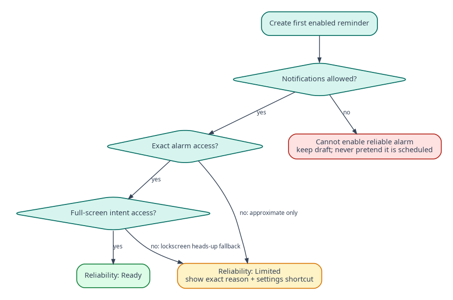
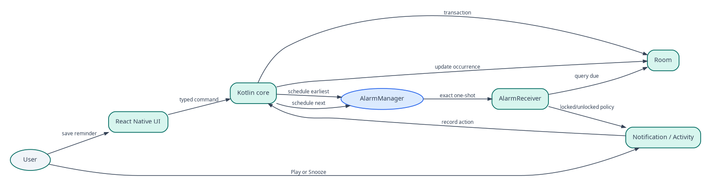
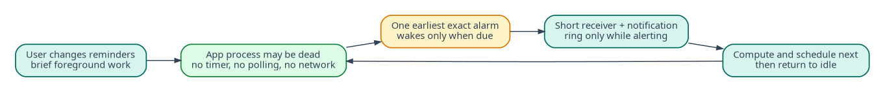
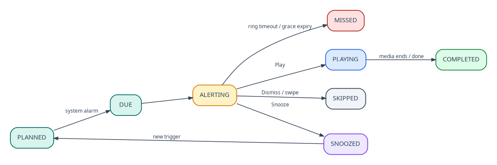

## Document control

| Field | Value |
|---|---|
| Document ID | MR-06 |
| Version | 1.0 |
| Status | Approved baseline |
| Last updated | 2026-08-05 |
| Product owner | Mohamed Aslam Abdul |
| Package identifier | `com.aslam.mediareminder` |
| Purpose | Define the native Android execution model, permissions, scheduling, adaptive presentation, ringing lifecycle, reboot recovery and battery controls. |

> **Reading rule:** This pack specifies a production-oriented Android application, not a promise that third-party devices will behave identically. Where Android or an OEM controls presentation, timing, sound, or permissions, the app provides transparent status and the strongest compliant fallback.

## Document conventions

The words **MUST**, **MUST NOT**, **SHOULD**, **SHOULD NOT**, and **MAY** are normative. A requirement ID is stable once published. Requirement IDs may be retired but MUST NOT be reassigned to a different meaning.

| Term | Meaning |
|---|---|
| Reminder | A user-authored instruction that connects content, a schedule, and a presentation profile. |
| Occurrence | One calculated due instance of a reminder. |
| Alarm session | The bounded runtime state created when an occurrence is actively alerting. |
| Media asset | An app-owned local video, audio, image, or text item. |
| Profile | Reusable alert behavior such as Gentle, Standard, or Persistent. |
| Exact-alarm access | Android special app access that allows exact scheduling where the platform requires it. |
| Full-screen intent | Android notification mechanism for urgent, time-sensitive activity presentation. It is not a general overlay. |
| Heads-up notification | System-rendered high-priority notification shown temporarily over the current app when Android permits it. |
| Source of truth | The authoritative specification or local persisted record for a decision or state. |

# Scope and safety position

This specification governs all behavior that must remain reliable when the React Native process is absent, slow or crashed. Alarm dispatch, action handling, alert stopping, next-event scheduling and active-session recovery are native Kotlin responsibilities.

Nudgio is an alarm/reminder application, but it is not a safety-of-life service. Exact timing means the strongest user-authorized Android mechanism available; it does not mean delivery through device shutdown, force-stop, disabled notifications, revoked access or every OEM modification.

# Android baseline

| Item | v1 baseline |
|---|---|
| Minimum Android | Android 8.0 / API 26 |
| Compile SDK | API 37 / Android 17 |
| Initial target SDK | API 36 / Android 16 |
| UI framework | React Native 0.86.x |
| Native language | Kotlin |
| Database | Room |
| Media | AndroidX Media3 |
| Alarm scheduler | `AlarmManager` one-shot exact alarm when authorized |
| General background work | WorkManager only for deferrable repair/maintenance, never for exact due delivery |

The target SDK decision is revisited before every release against current Play and direct-distribution requirements. Compilation against API 37 permits current compatibility testing without claiming all API 37 behavior is targeted in v1.

# Permission policy

## Manifest declarations

| Permission/capability | Reason | Request policy |
|---|---|---|
| `POST_NOTIFICATIONS` | Show due alerts on Android 13+ | Runtime request immediately before first active reminder or Test reminder |
| `SCHEDULE_EXACT_ALARM` | User-authorized exact alarms | Special-access education after user selects exact timing; never at cold launch |
| `USE_FULL_SCREEN_INTENT` | Locked/non-interactive alarm surface where eligible | Manifest declaration; check effective eligibility on API 34+ |
| `RECEIVE_BOOT_COMPLETED` | Reconcile schedules after reboot | Manifest; no user dialog |
| `VIBRATE` | Profile vibration | Manifest; user profile controls behavior |
| `FOREGROUND_SERVICE` | Bounded active ringing service | Manifest; service exists only during active alert |
| `FOREGROUND_SERVICE_MEDIA_PLAYBACK` | Active audible alarm/media playback on modern Android | Manifest and `mediaPlayback` service type |
| `WAKE_LOCK` | Bounded wake bridge/active alert only | Manifest; every acquisition has explicit timeout |

## Explicitly excluded

The production manifest MUST NOT declare `INTERNET`, `SYSTEM_ALERT_WINDOW`, broad `READ_MEDIA_*` gallery access merely for import, `REQUEST_IGNORE_BATTERY_OPTIMIZATIONS`, `ACCESS_NOTIFICATION_POLICY`, `READ_PHONE_STATE`, location, contacts, microphone or camera.

`USE_EXACT_ALARM` is intentionally not used in v1 because it is intended for narrowly qualifying app categories and carries distribution implications. The user-controlled `SCHEDULE_EXACT_ALARM` path is more transparent for an open-source general media reminder. This decision is reviewed if store policy establishes a better qualified route.

# Capability state machine

The app maintains observed capability states, never a single “permissions granted” Boolean.

| Capability | Ready | Limited | Blocked |
|---|---|---|---|
| Notifications | Runtime permission granted and channel not blocked | Permission granted but effective channel below high importance | Runtime permission denied or all relevant channel blocked |
| Exact timing | `canScheduleExactAlarms()` true | User selected inexact Limited mode | Access false and user declined Limited mode |
| Full-screen locked alert | Manifest permission effective and platform permits FSI | Notification fallback available | Notifications blocked |
| Media | App-owned asset readable | Asset missing but reminder retained disabled | Storage corruption or unresolved operation |
| Scheduler | Next event persisted and OS alarm registered | Reconciliation pending | No eligible reminder or unrecoverable database fault |

Health MUST show both app preference and observed Android behavior. Notification channel settings are user-owned after creation; app profile edits cannot silently raise a channel the user lowered.

# Scheduling architecture

## One global next alarm

At any stable point, the application schedules at most one ordinary next-due `PendingIntent` for reminders, plus explicitly bounded test or maintenance alarms. It does not call `setRepeating()`.

Algorithm:

1. In one database transaction, resolve stale active sessions and query the earliest eligible occurrence.
2. Persist `scheduler_state` with occurrence UUID, due instant, generation and pending-intent request code.
3. Cancel the previously registered pending intent when identity changed.
4. If exact access is available, call `AlarmManager.setAlarmClock()` with the occurrence trigger and a show-intent to the Reminders screen. This makes alarm intent visible to system surfaces and is appropriate for user-visible alarm functionality.
5. If exact access is unavailable and the user accepted Limited mode, call `setAndAllowWhileIdle()` or the best compliant inexact mechanism, label the reminder Limited, and do not claim exactness.
6. If no eligible event exists, cancel the previous alarm and clear scheduler state.

Every operation uses immutable/update-current `PendingIntent` flags appropriate to API level. Identity is based on a stable scheduler slot, while occurrence identity is authenticated in extras and verified against Room.

## Why not WorkManager

WorkManager is used only for deferrable tasks such as orphan-cache cleanup, optional integrity scanning and retrying a nonurgent export finalization. It MUST NOT deliver scheduled reminders because its execution window is not an exact alarm contract.

## Recalculation triggers

Recalculate after reminder create/edit/enable/disable/delete, profile change that affects eligibility, snooze, dismiss, play, timeout, asset availability change, import commit, exact-alarm access change, notification permission change, boot, package replacement, timezone change, significant clock change and startup reconciliation.

# Alarm dispatch

`AlarmDispatchReceiver` is a small manifest receiver implemented in Kotlin. It MUST:

1. call `goAsync()` and finish quickly;
2. load scheduler state and occurrence in Room;
3. reject stale generation, mismatched UUID or already-resolved occurrence;
4. atomically claim the occurrence using an idempotency row;
5. create or recover one `active_alarm_session`;
6. calculate device presentation state;
7. post the notification and, if appropriate, start the bounded ringing service and full-screen path;
8. schedule the next occurrence before completing, or queue reconciliation;
9. release its short wake bridge and finish.

Target receiver-to-visible-alert latency is under 500 ms p95 on reference devices and must never intentionally wait for the React Native bundle.

# Adaptive presentation decision

Native code samples:

- `PowerManager.isInteractive`;
- `KeyguardManager.isDeviceLocked` and keyguard visibility;
- whether Nudgio has a resumed foreground activity;
- notification permission/channel status;
- full-screen eligibility on supported APIs.

Decision rules:

1. If the device is locked or non-interactive, profile permits locked alarm, notifications are usable and full-screen intent is eligible, post a high-importance alarm notification with a full-screen intent to `AlarmActivity` and start bounded ringing.
2. If the device is locked/non-interactive but full-screen intent is not eligible, post the highest compliant lock-screen notification, start only behavior allowed by the effective channel/service policy, and record Limited FSI state.
3. If the device is unlocked and interactive, post a high-importance notification **without** a full-screen intent. Android may present it as heads-up. Never launch `AlarmActivity` directly.
4. If the app is foreground, additionally emit an event to show the in-app strip. The system notification remains the fallback.
5. If state is uncertain, choose the unlocked notification path.

Android controls heads-up dimensions, duration, ranking and whether it appears. The app can design notification content and channel importance but cannot guarantee a 20%-height dropdown over another app.

# Full-screen alarm activity

`AlarmActivity` is native, exported false, noHistory, excludeFromRecents and backed by active session ID. It uses `setShowWhenLocked(true)` and `setTurnScreenOn(true)` on supported APIs. It does not dismiss keyguard without explicit platform-authorized user flow.

The activity displays static reminder context and native Play, Snooze and Dismiss controls. It MUST handle configuration change, process recreation and duplicate intents. Closing the activity through Back is mapped to a profile-defined safe outcome; default is collapse to the notification while ringing continues for Standard/Persistent and stop for Gentle. The UI makes this explicit.

No media autoplays in the alarm activity. Play first stops alarm sound, then opens `MediaPlayerActivity`. This avoids competing alarm/media audio and respects the user's action.

# Notification construction

Notification categories use `CATEGORY_ALARM` for Standard/Persistent due alerts and `CATEGORY_REMINDER` for Gentle. Visibility defaults to private; lock-screen content follows the user's **Show reminder names on lock screen** setting. Secret visibility is available.

Actions are native broadcast pending intents:

- `ACTION_PLAY(sessionId, nonce)`;
- `ACTION_SNOOZE_DEFAULT(sessionId, nonce)`;
- `ACTION_DISMISS(sessionId, nonce)`.

A content intent opens the due item or media player without resolving it. Delete intent from notification shade maps to profile-defined Ignore/timeout, not Dismiss, and is recorded distinctly.

The notification is ongoing only during active ringing when necessary to prevent accidental clearing. It becomes removable after sound stops. Notification IDs are derived from stable session hashes with collision tests.

# Notification channels

Channels are versioned because Android channel importance and sound become user-controlled after creation. New defaults require a new channel version and a transparent migration prompt; old channels are retained while referenced.

The Health screen opens the relevant system channel settings and displays:

- expected app profile;
- effective importance where readable;
- whether sound/vibration is controlled by Android;
- test action.

The app MUST NOT delete and recreate a channel to override a user's choice.

# Ringing service

`AlarmRingingService` is a native foreground service started only for a claimed active alarm session that requires continuous sound or vibration. It declares media playback type and immediately posts the session notification before the platform deadline.

Responsibilities:

- play packaged/default/custom tone with `AudioAttributes.USAGE_ALARM`;
- apply a bounded vibration waveform;
- obtain audio focus where appropriate and respond to focus loss;
- maintain a session-scoped partial wake lock only while actively ringing, with an absolute timeout;
- stop within one second of Play, Snooze, Dismiss, timeout or invalidated session;
- recover its session after service recreation from Room, or stop if no valid session exists.

The service MUST NOT be sticky when no valid session remains. Maximum active lifetime is profile timeout, hard-capped at 10 minutes in v1. Persistent retry is implemented as future one-shot alarms, not an endlessly running service.

# Audio behavior

- Alarm audio never uses the attached media file before Play.
- The app respects silent/DND/channel behavior as controlled by Android; it does not request DND policy access in v1.
- During a detected communication audio mode, default behavior is to reduce to notification sound/vibration rather than overpower a call. No phone-state permission is requested.
- Hardware volume keys alter the system stream according to Android; the alarm UI also has a visible **Silence sound** action in accessibility overflow.
- Bluetooth/headphone routing follows system alarm routing. The app does not secretly force speaker output.
- When Play begins, alarm sound stops before Media3 requests media audio focus.

# Wake and battery behavior

Idle expectations:

- process may be dead;
- no service is resident;
- no wake lock is held;
- no JavaScript timer runs;
- one next alarm is registered.

Wake resources:

- receiver bridge wake lock: maximum 10 seconds and released in `finally`;
- active alert wake lock: session-scoped and hard-capped to alarm timeout;
- no wake lock during normal media browsing once activity lifecycle is sufficient;
- every acquisition is tagged and covered by unit/static tests.

No battery optimization exemption request is part of onboarding. OEM troubleshooting is optional, manufacturer-specific guidance is clearly labeled, and Test reminder is preferred over asking for unrestricted background operation.

# Doze and app standby

Exact alarms authorized by the user are used for due events. Inexact Limited mode may be delayed in Doze and MUST be labeled accordingly. The app does not schedule frequent `allowWhileIdle` events to bypass system quotas. Snooze is a user-visible alarm and is scheduled through the same exact-access path.

# Reboot and direct boot

The manifest receiver listens for `LOCKED_BOOT_COMPLETED`, `BOOT_COMPLETED`, `MY_PACKAGE_REPLACED`, `TIME_SET`, `TIMEZONE_CHANGED` and exact-alarm permission state changes where available.

A minimal next-alarm envelope containing no media path or sensitive label is mirrored into device-protected storage. Before first unlock after reboot, the app can reschedule a generic due alert. Media and full reminder details remain credential-protected; Play asks the user to unlock. After `BOOT_COMPLETED`, Room reconciliation replaces the envelope and normal behavior resumes.

If direct-boot support is omitted from an early build, the limitation MUST be stated and the release cannot claim pre-unlock reboot recovery. The approved v1 target includes the minimal envelope.

# Time and timezone changes

Wall-clock recurring rules follow the device timezone by default. On `TIME_SET` or `TIMEZONE_CHANGED`, native code invalidates derived occurrences beyond the idempotency horizon, recalculates, and registers the next alarm. Already resolved occurrence keys prevent replay after clock rollback.

A once reminder stores an instant and does not move when timezone changes; its display updates to the new local equivalent. A daily reminder stores local time and follows the user's day.

# Process death, crash and force-stop

Normal process death is fully supported. All actionable state exists in Room and native services/receivers can reconstruct it.

After user force-stop, Android suppresses alarms and broadcasts until the app is manually opened again. Nudgio cannot override this. Health detects the next launch, explains the interruption, reconciles schedules and offers Test reminder. Copy MUST never imply that battery-efficient architecture bypasses force-stop.

# State machine

Valid session transitions are:

`Claimed -> Alerting -> {Snoozed, Dismissed, TransitioningToMedia, TimedOut, FailedSafe}`  
`TransitioningToMedia -> {MediaPlaying, AcceptedMediaUnavailable}`  
Terminal transitions are idempotent. Any invalid transition stops sound first, records a diagnostic and resolves to FailedSafe.

# Android acceptance criteria

- **AND-001:** No unlocked/interactively used device test launches a full-screen activity.
- **AND-002:** Play/Snooze/Dismiss work with the React Native bridge intentionally disabled.
- **AND-003:** Only one ordinary next due alarm is registered after any stable operation.
- **AND-004:** No wake lock remains after the terminal session state.
- **AND-005:** A reboot restores the next event, including generic direct-boot behavior before unlock.
- **AND-006:** Revoking exact access cancels exact pending alarms, marks affected reminders and presents Limited choices.
- **AND-007:** Notification denial never starts an invisible continuous ringing service.
- **AND-008:** Full-screen ineligibility produces a transparent notification fallback.
- **AND-009:** Trigger-to-alert and action-stop budgets meet MR-15.
- **AND-010:** Manifest inspection confirms excluded permissions are absent.

---

## Governance

This document is part of the **Nudgio Source-of-Truth Pack v1.0**. In case of conflict, apply this precedence order: (1) explicit platform safety and permission rules, (2) Architecture Decision Records, (3) Android specification, (4) data and backup specifications, (5) PRD and feature specification, (6) UX and visual guidance, (7) implementation notes. Record any intentional deviation in the decision log before release.

