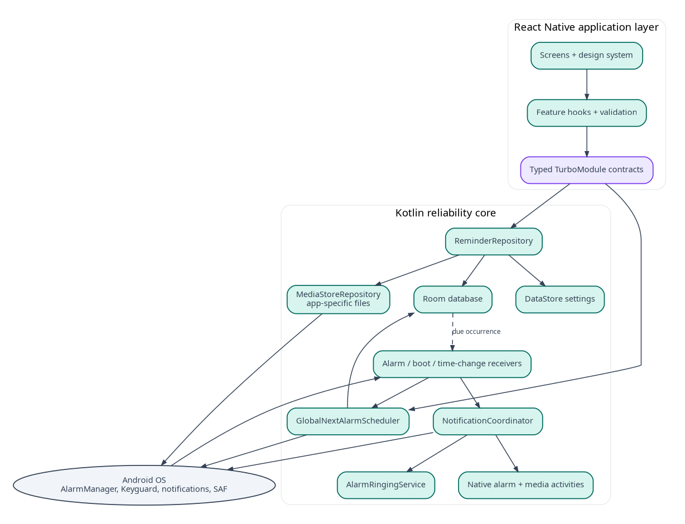

## Document control

| Field | Value |
|---|---|
| Document ID | MR-07 |
| Version | 1.0 |
| Status | Approved baseline |
| Last updated | 2026-08-05 |
| Product owner | Mohamed Aslam Abdul |
| Package identifier | `com.aslam.mediareminder` |
| Purpose | Define system components, dependency direction, runtime boundaries, deployment structure, failure isolation and implementation patterns. |

> **Reading rule:** This pack specifies a production-oriented Android application, not a promise that third-party devices will behave identically. Where Android or an OEM controls presentation, timing, sound, or permissions, the app provides transparent status and the strongest compliant fallback.


## Document conventions

The words **MUST**, **MUST NOT**, **SHOULD**, **SHOULD NOT**, and **MAY** are normative. A requirement ID is stable once published. Requirement IDs may be retired but MUST NOT be reassigned to a different meaning.

| Term | Meaning |
|---|---|
| Reminder | A user-authored instruction that connects content, a schedule, and a presentation profile. |
| Occurrence | One calculated due instance of a reminder. |
| Alarm session | The bounded runtime state created when an occurrence is actively alerting. |
| Media asset | An app-owned local video, audio, image, or text item. |
| Profile | Reusable alert behavior such as Gentle, Standard, or Persistent. |
| Exact-alarm access | Android special app access that allows exact scheduling where the platform requires it. |
| Full-screen intent | Android notification mechanism for urgent, time-sensitive activity presentation. It is not a general overlay. |
| Heads-up notification | System-rendered high-priority notification shown temporarily over the current app when Android permits it. |
| Source of truth | The authoritative specification or local persisted record for a decision or state. |

# Architectural style

Nudgio uses a **hybrid offline mobile architecture**:

- React Native provides the normal application UI, navigation, forms and most presentation logic.
- Kotlin owns time-critical and background-safe behavior.
- Room is the authoritative application database and is accessed through native repositories.
- App-specific files hold imported media; cache holds derived thumbnails and temporary render artifacts.
- Android system services own scheduling, notification presentation, lock-screen policy and permission grants.

This is not a JavaScript app with a thin alarm plugin. The alarm core is a native subsystem with a typed React Native client.



# Component map

## React Native application

- `app-shell`: startup routing, theme, capability banner and global error boundary;
- `features/today`: occurrence timeline and next reminder;
- `features/library`: media list, metadata forms and preview orchestration;
- `features/reminders`: editor, recurrence form and profile selection;
- `features/settings`: Health, backup, profiles, privacy and About;
- `design-system`: tokens and accessible components;
- `native-client`: generated TypeScript interface to the TurboModule;
- `state`: view state and query cache only; no duplicate source-of-truth schedule database.

## Kotlin domain and data

- `ReminderRepository`;
- `MediaRepository`;
- `ProfileRepository`;
- `OccurrenceCalculator`;
- `SchedulerCoordinator`;
- `CapabilityRepository`;
- `AlarmSessionCoordinator`;
- `NotificationCoordinator`;
- `BackupRepository`;
- `DiagnosticRepository`.

## Android entry components

- `MainActivity` - React Native host;
- `AlarmDispatchReceiver` - due event claim and presentation decision;
- `AlarmActionReceiver` - Play/Snooze/Dismiss native commands;
- `SystemEventReceiver` - reboot/time/app-update/capability reconciliation;
- `AlarmRingingService` - bounded active sound/vibration;
- `AlarmActivity` - locked-screen native controls;
- `MediaPlayerActivity` - native resilient playback for accepted reminders;
- `MediaReminderFileProvider` - read-only sharing of completed exports.

# Dependency rules

1. React Native features depend on the generated native client, never Android classes directly.
2. Android entry components depend on use cases/coordinators, not on UI or raw DAOs.
3. Repositories depend on Room DAOs and file gateways.
4. Domain calculation code has no Android UI dependency and is JVM-testable.
5. Backup DTOs are separate from Room entities and UI models.
6. Notification and scheduler identifiers are produced by dedicated factories with collision tests.
7. React state is disposable; killing the JS process must not lose user intent or active-session truth.

# Source-of-truth ownership

| Data | Owner | Read access |
|---|---|---|
| Reminders, profiles, schedules, occurrences | Room | Kotlin repositories; RN through queries |
| Imported media bytes | App-specific file storage | Media repository/player only |
| Derived thumbnails | Cache directory | UI/player; safely regenerable |
| Theme and lightweight preferences | DataStore | Settings repository |
| Active alarm session | Room plus bounded OS components | Alarm core and UI |
| Next registered alarm | Android AlarmManager plus mirrored scheduler row | Scheduler coordinator |
| Notification channel settings | Android OS | Capability repository, partial observability |
| View navigation/filter state | React state | React UI only |

# Repository layout

```text
nudgio/
  android/app/src/main/java/com/aslam/mediareminder/
    alarm/
    backup/
    capability/
    data/
    media/
    notifications/
    bridge/
    diagnostics/
  src/
    app/
    design-system/
    features/
    native-client/
    localization/
    testing/
  specs/                  # Markdown source-of-truth pack
  docs/                   # portfolio and contributor docs
  fixtures/               # synthetic media and backup fixtures
  scripts/                # build, schema, checksum and release tooling
```

Feature folders own screens, hooks, view models, tests and local types. Shared abstractions require two real consumers before promotion to a shared folder.

# Startup sequence

1. Android creates `MainActivity` and initializes the RN host.
2. A native startup reconciler checks incomplete file/backup operations and active session consistency on an IO dispatcher.
3. React renders a fast shell using DataStore theme.
4. UI requests a `StartupSnapshot` from the native module: counts, next occurrence, capability summary, repair state and schema version.
5. Long repair operations surface as a dedicated state rather than blocking a blank splash screen.
6. The scheduler reconciles only if persisted generation or environment fingerprint requires it.

Cold startup does not enumerate or hash the full media library.

# Native module

Use a Codegen/TurboModule interface so TypeScript and native signatures are generated/validated. The module exposes coarse-grained use cases rather than DAOs. Methods return serializable DTOs with ISO instants, stable UUIDs and typed error codes. Large media bytes never cross the bridge.

Events are limited to:

- `capabilityChanged`;
- `reminderDueWhileForeground`;
- `importProgress`;
- `exportProgress`;
- `repairStateChanged`.

Every event includes a monotonic sequence and correlation ID. UI can always refetch authoritative state if an event is lost.

# Concurrency model

- Room writes run in transactions on `Dispatchers.IO`.
- Schedule calculation is pure and deterministic, called within a coordinator lock/mutex.
- File operations use a bounded IO pool and stream buffers; no whole-file byte arrays.
- Alarm action processing uses a database idempotency claim, not only an in-memory mutex.
- Only the active alarm session may own ringing resources.
- Backup import uses a single exclusive application mutation lock; read-only browsing may continue until commit, but reminder edits are temporarily disabled during final commit.

# File architecture

```text
files/
  media/<asset-uuid>.<normalized-extension>
  text/<asset-uuid>.json
  exports/                 # optional short-lived completed files before user save/share
  rollback/<operation-id>/ # bounded temporary rollback snapshot
cache/
  thumbnails/<asset-uuid>.webp
  import/<operation-id>/
  export/<operation-id>/
  playback/
no_backup/
  diagnostics/
device_protected/
  next_alarm_envelope.json
```

The database never stores absolute paths. It stores storage key + relative name. File path resolution is centralized and rejects traversal.

# Scheduler transaction pattern

Because AlarmManager is outside Room, scheduling is an outbox-style operation:

1. transaction updates user intent, derived occurrence and `scheduler_state` desired generation;
2. coordinator applies desired state to AlarmManager;
3. on success it records applied generation;
4. on process death between steps, startup/system-event reconciliation sees desired != applied and retries;
5. receiver validates generation, so stale pending intents cannot act on new state.

This avoids pretending a database transaction can atomically include an operating-system alarm registration.

# Alarm isolation

The native alarm core has no dependency on Metro, bundle loading, navigation readiness or React component state. It uses native resources for action labels and accessibility strings. The React UI may enhance the foreground presentation but can never be the only way to stop sound.

# Media playback

`MediaPlayerActivity` uses Media3 ExoPlayer with local `file://`/content resolver abstraction internal to the app. It receives only an asset UUID and session token. It validates the token, resolves the app-owned file and starts after the Play action. It handles audio focus, lifecycle pause, rotation, PiP disabled in v1, and unsupported codec errors.

Playback completion can record Completed when the user watches/listens beyond a configurable threshold; MVP defaults to Accepted on Play and optionally Completed on natural end. The distinction is documented and not used to shame the user.

# Backup architecture

Export creates immutable logical DTOs from a consistent database snapshot, streams JSON and media to the user-selected destination, then writes checksums and closes the archive. Import streams to private staging, validates, creates a conflict plan, and commits through repositories. Raw DAOs are never exposed to arbitrary archive fields.

# Error architecture

Errors have four layers:

- domain code, e.g. `SCHEDULE_NONEXISTENT_LOCAL_TIME`;
- user-safe message key;
- diagnostic correlation ID;
- optional internal cause in local logs.

No user-visible stack trace. No file name in diagnostic export unless the user explicitly includes a redacted mapping. Components fail safe: alert errors stop sound, import errors leave current data unchanged, scheduler errors preserve desired state for reconciliation.

# Build variants

- `debug`: developer tools, synthetic event injector, verbose local log;
- `qa`: release-like signing, test fixtures and controlled diagnostics, no remote analytics;
- `release`: no debug menus, no Internet permission, minified only after native action tests pass.

A build-time manifest test fails if excluded permissions or undeclared exported components appear.

# Dependency policy

Prefer AndroidX/Jetpack and React Native core. Any third-party library must have active maintenance, compatible license, no hidden network requirement, modern Android support and a clear removal path. Native alarm scheduling should not depend on a generic notification package that obscures platform behavior; small platform wrappers are owned in-repo.

# Observability

Local structured diagnostics use bounded files and privacy-safe event fields. Key events include scheduler desired/applied generation, trigger delta, presentation decision, action latency, permission snapshot code, service lifetime, wake-lock lifetime, import/export phase and repair result. No content titles or file paths.

# Architectural acceptance

- Build succeeds with React Native runtime removed from an alarm instrumentation fixture.
- Static dependency tests prevent Android entry components from importing React UI packages.
- Room is the only reminder source of truth.
- A stale PendingIntent cannot resolve a newer occurrence.
- Crash injection at each import and restore phase results in either old or committed state, not mixed state.
- Release manifest contains no Internet or overlay permission.

---

## Governance

This document is part of the **Nudgio Source-of-Truth Pack v1.0**. In case of conflict, apply this precedence order: (1) explicit platform safety and permission rules, (2) Architecture Decision Records, (3) Android specification, (4) data and backup specifications, (5) PRD and feature specification, (6) UX and visual guidance, (7) implementation notes. Record any intentional deviation in the decision log before release.

