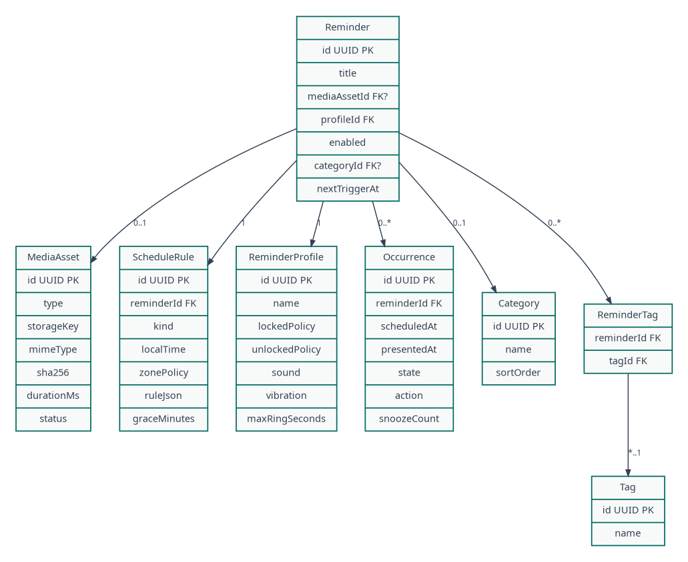

## Document control

| Field | Value |
|---|---|
| Document ID | MR-09 |
| Version | 1.0 |
| Status | Approved baseline |
| Last updated | 2026-08-05 |
| Product owner | Mohamed Aslam Abdul |
| Package identifier | `com.aslam.mediareminder` |
| Purpose | Define the Room schema, relationships, constraints, migrations, file layout, integrity model and transactional recovery. |

> **Reading rule:** This pack specifies a production-oriented Android application, not a promise that third-party devices will behave identically. Where Android or an OEM controls presentation, timing, sound, or permissions, the app provides transparent status and the strongest compliant fallback.

## Document conventions

The words **MUST**, **MUST NOT**, **SHOULD**, **SHOULD NOT**, and **MAY** are normative. A requirement ID is stable once published. Requirement IDs may be retired but MUST NOT be reassigned to a different meaning.

| Term | Meaning |
|---|---|
| Reminder | A user-authored instruction that connects content, a schedule, and a presentation profile. |
| Occurrence | One calculated due instance of a reminder. |
| Alarm session | The bounded runtime state created when an occurrence is actively alerting. |
| Media asset | An app-owned local video, audio, image, or text item. |
| Profile | Reusable alert behavior such as Gentle, Standard, or Persistent. |
| Exact-alarm access | Android special app access that allows exact scheduling where the platform requires it. |
| Full-screen intent | Android notification mechanism for urgent, time-sensitive activity presentation. It is not a general overlay. |
| Heads-up notification | System-rendered high-priority notification shown temporarily over the current app when Android permits it. |
| Source of truth | The authoritative specification or local persisted record for a decision or state. |

# Persistence objectives

Persistence MUST remain correct through process death, reboot, partial file copy, notification action races, import cancellation and schema upgrades. Room is authoritative for logical data. The filesystem stores app-owned bytes. DataStore stores small preferences and a device-protected alarm envelope.

# Database configuration

- Database filename is internal and never included in backups.
- Room uses WAL mode where supported.
- Foreign keys are enabled.
- Destructive migration is prohibited in release builds.
- Encryption-at-rest beyond Android sandbox/file-based encryption is a future option; v1 backups are explicitly unencrypted.
- Timestamps are UTC epoch milliseconds in Room; bridge/export serializes ISO-8601.
- Primary IDs are UUID strings generated by secure platform UUID.
- User-visible sort normalization is stored separately only when profiling demonstrates need.

# Core entities

## `media_assets`

| Column | Type | Constraints/purpose |
|---|---|---|
| `id` | TEXT | PK UUID |
| `kind` | TEXT | video/audio/image/text enum |
| `title` | TEXT | 1-160 Unicode scalar length |
| `notes` | TEXT nullable | max 4000 characters |
| `storage_key` | TEXT | relative opaque filename, unique |
| `mime_type` | TEXT | normalized detected type |
| `size_bytes` | INTEGER | nonnegative |
| `sha256` | TEXT | 64 lowercase hex, indexed |
| `duration_ms` | INTEGER nullable | nonnegative |
| `width_px`,`height_px` | INTEGER nullable | decoded metadata |
| `category_id` | TEXT nullable | FK categories, SET NULL |
| `integrity_state` | TEXT | healthy/unchecked/missing/changed/unsupported |
| `created_at`,`updated_at` | INTEGER | UTC millis |
| `entity_version` | INTEGER | optimistic concurrency |

No source gallery URI is required after copy. Optional provenance such as original display name is excluded by default or stored as user-visible metadata only after privacy review.

## `reminder_profiles`

Stable built-in UUIDs are seeded in migration. Columns include name, built-in flag, channel class/version, sound mode/reference, vibration JSON validated by converter, full-screen-on-locked Boolean, timeout seconds, retry count/interval, grace seconds, default snooze minutes, created/updated and entity version.

Profile timeout range: 15-600 seconds. Retry count: 0-3 in v1. Vibration total duration is capped.

## `reminders`

| Column | Purpose |
|---|---|
| `id` | PK UUID |
| `media_id` | FK media, restrict until dependency policy chosen |
| `profile_id` | FK profile, restrict |
| `label` | display label; default copied from title but independent |
| `notes` | reminder-specific notes |
| `enabled_intent` | user's desired enabled state |
| `effective_state` | disabled/needs_setup/active/archived |
| `snooze_policy_json` | validated bounded values |
| `history_enabled` | local recording preference |
| `created_at`,`updated_at` | timestamps |
| `entity_version` | optimistic concurrency |

Effective state is derived but persisted for fast native queries and backup transparency; reconciliation can recompute it.

## `schedule_rules`

One-to-one with reminder in v1. Fields include type, once instant, local time seconds-of-day, ISO weekday mask, zone policy, origin zone, DST gap policy, DST overlap policy and rule version. Check constraints ensure only relevant fields are set for each type.

## `occurrences`

| Column | Purpose |
|---|---|
| `id` | PK UUID |
| `reminder_id` | FK reminder cascade |
| `kind` | base/snooze/retry/test |
| `parent_occurrence_id` | nullable self FK |
| `scheduled_at` | due instant |
| `occurrence_key` | unique deterministic key for base occurrence |
| `state` | pending/claimed/accepted/snoozed/dismissed/missed/timed_out/failed_safe |
| `triggered_at`,`resolved_at` | nullable timestamps |
| `action` | terminal action code |
| `created_at` | timestamp |

Unique `(reminder_id, occurrence_key)` prevents recurrence duplication. Only a bounded horizon of future derived occurrences is stored; the scheduler needs the next one, not years of rows.

## `active_alarm_session`

At most one row is active, enforced by a singleton key or unique partial invariant in repository logic. Contains session UUID, occurrence UUID, state, started time, presentation decision, notification ID, service started flag, wake deadline, action nonce generation and last update. Terminal sessions are moved to diagnostics/history or deleted after reconciliation.

## `scheduler_state`

Singleton row: desired occurrence UUID/time, desired generation, applied generation, pending-intent identity, last reconcile time, last reason, last error code. It is an outbox record for AlarmManager synchronization.

## `pending_file_operations`

Tracks operation UUID, kind, temporary relative path, target relative path, associated entity UUID, phase, expected bytes/hash, created/updated and last error. Startup repair uses it to delete or finalize safe operations.

## `idempotency_records`

Stores scope, key, request hash, result summary, created/expiry. Alarm action records persist long enough to cover repeated notification intents. General UI operation records have shorter retention.

## categories and tags

`categories(id,name,normalized_name,sort_order,created_at,updated_at)` with unique normalized name.  
`tags(id,name,normalized_name,created_at,updated_at)` with unique normalized name.  
`reminder_tags(reminder_id,tag_id)` and optionally `media_tags(media_id,tag_id)` use composite primary keys.

## `schema_meta`

Stores schema version, backup writer version, created app version, last migration version/time and integrity check state.

# Indices

Required indices:

- `media_assets(sha256)`;
- `media_assets(category_id, updated_at)`;
- `reminders(effective_state, updated_at)`;
- `occurrences(state, scheduled_at)`;
- `occurrences(reminder_id, occurrence_key)` unique;
- `pending_file_operations(phase, updated_at)`;
- `idempotency_records(scope, key)` unique and `expires_at`;
- category/tag normalized names unique.

Query plans for Today, next occurrence, active reminder count and media dependency count are captured in performance tests.

# File storage

Imported bytes use an opaque UUID filename and normalized extension. The mapping is internal:

`files/media/7f3...a9.mp4`

No user-supplied path segment enters the file path. Text assets are JSON or UTF-8 in a separate directory. Derived thumbnails are WebP cache and may be cleared at any time. Export archives are written to a user-selected document URI where possible; a temporary private file is only used when the destination API requires it.

# Storage limits

Defaults, configurable only through build constants:

- individual asset soft warning at 500 MB;
- individual asset hard limit at 2 GB for v1 unless large-file tests pass;
- backup expected uncompressed hard limit at 10 GB or 80% of available space, whichever is lower;
- maintain 250 MB or 5% free-storage reserve after import/restore, whichever is greater;
- text title 160 characters, notes 4000, category/tag 60;
- diagnostics 5 MB ring buffer;
- thumbnails cache 250 MB with LRU eviction.

These values are product protections, not filesystem capabilities. The UI displays estimates before copy.

# Import atomicity

The database and filesystem cannot share a true atomic transaction. Use a journaled two-phase protocol:

1. persist pending operation;
2. stream and verify temporary file;
3. atomically rename on same filesystem;
4. transaction inserts record and marks operation committed;
5. cleanup removes journal.

On startup:

- temp exists, no target, phase Copying -> delete temp;
- target exists, no media row, phase Promoted -> verify hash then complete row only if full metadata exists, otherwise quarantine/delete;
- media row exists, target missing -> mark Missing and disable reminders;
- both exist and hash valid -> complete/clear operation.

# Backup transaction support

Before Replace import, current logical records are exported to a private rollback package and current media map is journaled. Commit stages new media under an operation directory, inserts data in a Room transaction using conflict plan, atomically promotes files, applies scheduler desired state and then removes rollback after verification. A crash at any point is recovered by operation phase.

# Database migrations

Every schema version has:

- forward Room migration;
- migration fixture from every supported prior public version or a tested chain;
- invariant checks;
- backup reader compatibility note;
- rollback strategy at release level (usually reinstall + restore, not database downgrade).

Migrations MUST be idempotent where retry could occur and MUST NOT hash entire large files on the main thread. Built-in profile changes use stable IDs and explicit version migration, preserving user edits unless reset.

# Integrity checks

Startup performs lightweight checks only. Full `PRAGMA integrity_check`, media hash audit and orphan scan are user-invoked or deferrable maintenance. Health reports last full check. Any database corruption path first copies the damaged database to a private recovery area with bounded retention, then offers Restore backup or Reset. It never silently deletes data.

# Data retention

Occurrence history defaults to 90 days. Diagnostic event retention is size/time bounded. Idempotency records are retained by scope: alarm action 7 days, UI mutation 24 hours, backup commit 30 days. Completed export temporary files expire after 24 hours unless the user saved them externally.

# Uninstall and clearing data

The app explains that Android removes app-specific media and database on uninstall or Clear storage. External exported ZIPs are not deleted. Cache clearing does not remove source media or reminders. “Reset app” requires explicit typed/destructive confirmation and optional export prompt.

# Database acceptance

- Foreign-key and check constraints pass on all fixtures.
- Crash injection at each two-phase file step reaches a documented repaired state.
- No database column contains an absolute filesystem path.
- Next occurrence query remains within MR-15 budget at 10,000 reminders/50,000 retained occurrences.
- Migration tests cover every public schema version.
- Export/import uses DTO mapping, not database file copy.

---

## Governance

This document is part of the **Nudgio Source-of-Truth Pack v1.0**. In case of conflict, apply this precedence order: (1) explicit platform safety and permission rules, (2) Architecture Decision Records, (3) Android specification, (4) data and backup specifications, (5) PRD and feature specification, (6) UX and visual guidance, (7) implementation notes. Record any intentional deviation in the decision log before release.

