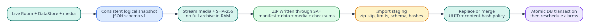

## Document control

| Field | Value |
|---|---|
| Document ID | MR-10 |
| Version | 1.0 |
| Status | Approved baseline |
| Last updated | 2026-08-05 |
| Product owner | Mohamed Aslam Abdul |
| Package identifier | `com.aslam.mediareminder` |
| Purpose | Define the portable ZIP format, manifest, checksums, validation, conflict handling, transactional restore and compatibility policy. |

> **Reading rule:** This pack specifies a production-oriented Android application, not a promise that third-party devices will behave identically. Where Android or an OEM controls presentation, timing, sound, or permissions, the app provides transparent status and the strongest compliant fallback.


## Document conventions

The words **MUST**, **MUST NOT**, **SHOULD**, **SHOULD NOT**, and **MAY** are normative. A requirement ID is stable once published. Requirement IDs may be retired but MUST NOT be reassigned to a different meaning.

| Term | Meaning |
|---|---|
| Reminder | A user-authored instruction that connects content, a schedule, and a presentation profile. |
| Occurrence | One calculated due instance of a reminder. |
| Alarm session | The bounded runtime state created when an occurrence is actively alerting. |
| Media asset | An app-owned local video, audio, image, or text item. |
| Profile | Reusable alert behavior such as Gentle, Standard, or Persistent. |
| Exact-alarm access | Android special app access that allows exact scheduling where the platform requires it. |
| Full-screen intent | Android notification mechanism for urgent, time-sensitive activity presentation. It is not a general overlay. |
| Heads-up notification | System-rendered high-priority notification shown temporarily over the current app when Android permits it. |
| Source of truth | The authoritative specification or local persisted record for a decision or state. |

# Goals

A backup must be portable between supported Android devices, inspectable, recoverable after interruption and independent of internal Room layout. It contains private user media and is therefore clearly labeled as sensitive. Version 1 archives are plain ZIP files; passphrase encryption is a later compatible format extension.



# File naming

Default filename:

`Nudgio_Backup_2026-08-05_221500_v1.0.mrbackup.zip`

The `.mrbackup.zip` suffix is descriptive only; the file remains a standard ZIP. User may rename it. Archive identity comes from `manifest.json`, not filename.

# Archive layout

```text
manifest.json
README.txt
checksums.sha256
data/
  media-assets.json
  reminder-profiles.json
  categories.json
  tags.json
  reminders.json
  schedule-rules.json
  reminder-tags.json
  settings.json
  history.json                 # optional
media/
  <asset-uuid>.<extension>
```

Excluded:

- Room database/WAL/SHM files;
- DataStore binary files;
- cache thumbnails;
- absolute or content URI paths;
- notification channel IDs as an assumption of effective behavior;
- permissions, exact-alarm grants, full-screen eligibility, DND settings;
- active alarm session and pending operation state;
- diagnostic logs unless explicitly exported through a separate support action.

# Manifest schema

```json
{
  "format": "com.aslam.mediareminder.backup",
  "archiveVersion": "1.0",
  "createdAt": "2026-08-05T14:15:00Z",
  "sourceAppVersion": "1.0.0",
  "sourceSchemaVersion": 1,
  "minimumReaderArchiveVersion": "1.0",
  "exportId": "uuid",
  "scope": "all",
  "includesHistory": false,
  "counts": {
    "mediaAssets": 12,
    "reminders": 18,
    "profiles": 3,
    "categories": 6,
    "tags": 9
  },
  "totalMediaBytes": "486392014",
  "hashAlgorithm": "SHA-256",
  "recordsEncoding": "UTF-8 JSON",
  "privacy": "contains-private-media",
  "extensions": {}
}
```

Unknown minor-version extension keys are ignored only inside designated `extensions` objects. Unknown required fields or unsupported major version stop import.

# JSON record rules

- UTF-8 without BOM.
- Top-level object includes `schema`, `records` array and optional extensions.
- Stable UUIDs are preserved.
- Instants are UTC ISO-8601.
- Enums use lowercase stable wire values.
- Strings retain Unicode; names are normalized only for conflict comparison, never rewritten silently.
- Numeric byte sizes use decimal strings where needed.
- JSON depth and string lengths are bounded during parse.
- Cross-file references must resolve before commit.

Example media record:

```json
{
  "id": "d7c2c52f-5b5c-4ced-8531-f9efbc2a6d8f",
  "kind": "video",
  "title": "Morning remembrance",
  "notes": null,
  "archivePath": "media/d7c2c52f-5b5c-4ced-8531-f9efbc2a6d8f.mp4",
  "mimeType": "video/mp4",
  "sizeBytes": "28390110",
  "sha256": "...64 lowercase hex...",
  "durationMs": 93400,
  "categoryId": "...",
  "createdAt": "2026-07-31T10:00:00Z",
  "updatedAt": "2026-08-04T12:12:00Z"
}
```

# Checksums

`checksums.sha256` contains SHA-256 for every file except itself, using a canonical two-space separator and relative POSIX path. It includes `manifest.json`, README, each data file and every media file. Export closes entries before writing the checksum file. Import recalculates while streaming and rejects mismatch.

A separate SHA-256 for the completed archive is displayed after export and may be published beside release fixtures; it is not stored within itself.

# Export algorithm

1. Preflight: query counts and media sizes, estimate destination needs, display privacy warning.
2. User selects destination through `ACTION_CREATE_DOCUMENT` or compatible document-provider flow.
3. Create export operation row with cancellation token.
4. Open a consistent logical database snapshot.
5. Stream manifest placeholder/data JSON/media entries through ZIP output; never load full media into memory.
6. Calculate per-entry hashes and written bytes.
7. Write final manifest values, using a staging ZIP when the destination cannot replace an earlier manifest entry safely.
8. Write checksums, close ZIP, flush destination and calculate archive hash where readable.
9. Verify central directory by reopening or lightweight parser validation.
10. Mark complete and offer read-only FileProvider share when a private temporary file was used.

Cancellation deletes or truncates the partial destination where the provider permits; otherwise it clearly labels that the provider may retain an incomplete file.

# Import phases

## 1. Acquisition

User chooses one ZIP through `ACTION_OPEN_DOCUMENT`. The app does not persist broad directory access. It streams/copies to a private staging location when random access or repeated validation is required.

## 2. Structural validation

Before extraction:

- confirm ZIP signature/central directory;
- cap entry count;
- reject absolute paths, drive prefixes, `..`, NUL and normalized duplicates;
- reject symlink-like entries and unsupported compression methods;
- cap per-entry and total uncompressed sizes;
- enforce compression-ratio threshold to reduce ZIP bomb risk;
- require exactly one root `manifest.json` and checksum file;
- reject duplicate entry names and case-fold collisions on relevant filesystems.

## 3. Semantic validation

- parse manifest with streaming/bounded parser;
- confirm format and version compatibility;
- validate all JSON schemas, lengths and enums;
- validate UUID uniqueness;
- resolve every foreign key;
- compare declared counts/sizes to actual;
- verify every checksum and media header/probe;
- estimate final disk needs including staging and rollback;
- create conflict plan without modifying current data.

## 4. Preview

Display archive date/version/counts, checksum result, unsupported records, conflict summary, storage requirement and permissions that cannot be restored. Generate an expiring `importToken` tied to staged bytes and validation digest.

## 5. Commit

Only a valid token can commit. Acquire exclusive mutation lock, recheck free space and current entity versions, create rollback snapshot for Replace, then apply plan through repositories. Promote files atomically, commit Room changes, clear derived occurrences, reconcile capabilities and schedule. Verify record counts and sampled/full hashes as policy requires. Remove staging after success.

# Import modes

## Inspect only

No mutation. User may view compatibility and conflicts, then cancel or continue.

## Merge

Existing data is retained. Rules:

- same UUID and same semantic record/hash: reuse existing;
- same media UUID and same hash but metadata differs: default keep local metadata, offer archive copy values in conflict review;
- same UUID with different media hash: conflict, import as new UUID with “Imported” suffix unless user selects local/archive;
- different UUID but same media hash: reuse existing bytes and create/import record mapping according to user choice;
- category/tag same normalized name: merge to local ID and remap references;
- reminder semantic duplicate: show conflict; default keep both disabled only when times/profiles differ, otherwise skip exact duplicate;
- built-in profile UUID: map to local built-in; archive customizations import as a new custom profile unless user explicitly applies them.

## Replace

All user logical data and app-owned media are replaced by archive scope after rollback snapshot. Device-owned settings remain unchanged. On completion, reminders are recalculated and set to Needs setup/disabled until capability review. Replace confirmation states that current local-only data will be removed.

# Conflict plan

Every conflict has stable identifier, local summary, archive summary, recommended action and consequences. Choices are deterministic and serializable so commit uses the reviewed plan. The plan expires if local entity versions change before commit.

# Atomicity and rollback

Restore uses operation phases:

`INSPECTED -> STAGED -> ROLLBACK_READY -> DB_PREPARED -> FILES_PROMOTED -> DB_COMMITTED -> VERIFIED -> SCHEDULED -> COMPLETE`

Crash recovery examines phase and journal. Before `DB_COMMITTED`, restore current state and delete staged files. After commit but before verification, finish verification/scheduling or roll back using snapshot. The user sees **Finishing previous restore** on next launch.

# Compatibility

Archive version uses major/minor:

- reader MUST reject a higher major version;
- reader MAY accept higher minor only when manifest declares current reader sufficient and unknown fields are extension-scoped;
- writer produces the oldest practical format compatible with current features;
- backup migrations convert DTOs in staging, never mutate original ZIP;
- at least the last three public major app releases' archives are supported where feasible;
- support policy is published in release notes.

# Encryption roadmap

Plain ZIP v1 is intentional for portability and transparent recovery. The export screen warns that anyone with the file can read it. P1 encryption adds a new archive major/version using established authenticated encryption and password-based key derivation; it MUST not invent a custom cipher. Forgotten passphrases cannot be recovered, and metadata leakage is documented.

# Sharing and privacy

Completed private exports shared through another app use FileProvider with read-only temporary URI permission. The app never grants a whole directory. Share chooser copy says that the selected destination controls the file after sharing. Export history stores no destination path by default.

# Validation limits

Baseline configurable limits:

- 20,000 ZIP entries;
- 10 GB expected uncompressed or available-space policy, whichever is lower;
- 2 GB per media entry for v1;
- 100 MB maximum aggregate JSON (far above normal use but bounded);
- compression ratio warning at 100:1 and rejection at a security-reviewed threshold;
- nesting is irrelevant because entries are flat; nested ZIP media is treated as opaque unsupported media, not recursively extracted.

# Backup acceptance

- **BKP-001:** A clean-device round trip preserves supported logical equality and media SHA-256.
- **BKP-002:** Malicious traversal, duplicate, symlink, bomb and checksum fixtures are rejected before current data changes.
- **BKP-003:** Cancellation/crash at every phase leaves either old or fully imported state after repair.
- **BKP-004:** Higher unsupported major version produces a non-destructive update-required result.
- **BKP-005:** Replace cannot proceed without a validated token, conflict plan and rollback-ready state.
- **BKP-006:** Notification permissions, exact access and channel settings are never reported as restored.
- **BKP-007:** Export peak memory remains within MR-15 regardless of media size.

---

## Governance

This document is part of the **Nudgio Source-of-Truth Pack v1.0**. In case of conflict, apply this precedence order: (1) explicit platform safety and permission rules, (2) Architecture Decision Records, (3) Android specification, (4) data and backup specifications, (5) PRD and feature specification, (6) UX and visual guidance, (7) implementation notes. Record any intentional deviation in the decision log before release.

