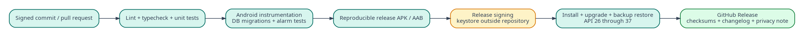

## Document control

| Field | Value |
|---|---|
| Document ID | MR-20 |
| Version | 1.0 |
| Status | Approved baseline |
| Last updated | 2026-08-05 |
| Product owner | Mohamed Aslam Abdul |
| Package identifier | `com.aslam.mediareminder` |
| Purpose | Define signing, APK publication, release evidence, optional store path, support, maintenance and portfolio presentation. |

> **Reading rule:** This pack specifies a production-oriented Android application, not a promise that third-party devices will behave identically. Where Android or an OEM controls presentation, timing, sound, or permissions, the app provides transparent status and the strongest compliant fallback.

## Document conventions

The words **MUST**, **MUST NOT**, **SHOULD**, **SHOULD NOT**, and **MAY** are normative. A requirement ID is stable once published. Requirement IDs may be retired but MUST NOT be reassigned to a different meaning.

| Term | Meaning |
|---|---|
| Reminder | A user-authored instruction that connects content, a schedule, and a presentation profile. |
| Occurrence | One calculated due instance of a reminder. |
| Alarm session | The bounded runtime state created when an occurrence is actively alerting. |
| Media asset | An app-owned local video, audio, image, or text item. |
| Profile | Reusable alert behavior such as Gentle, Standard, or Persistent. |
| Exact-alarm access | Android special app access that allows exact scheduling where the platform requires it. |
| Full-screen intent | Android notification mechanism for urgent, time-sensitive activity presentation. It is not a general overlay. |
| Heads-up notification | System-rendered high-priority notification shown temporarily over the current app when Android permits it. |
| Source of truth | The authoritative specification or local persisted record for a decision or state. |

# Distribution strategy

The primary v1 channel is a signed APK published through GitHub Releases from a public source tag. The portfolio site links to that release rather than an unversioned file. Google Play distribution is optional and requires a separate policy/readiness review, but the app is built to meet current target and permission disclosure expectations.

There is no in-app updater because the production app has no Internet permission. Users obtain updates through the release page or an optional future store.

# Application identity

| Field | Value |
|---|---|
| App name | Nudgio |
| Package | `com.aslam.mediareminder` |
| Versioning | Semantic user version plus monotonically increasing Android version code |
| Source license | Apache-2.0 |
| Minimum SDK | 26 |
| Initial target | 36 |
| Compile SDK | 37 |
| Distribution artifact | Signed arm64/universal APK as chosen, plus optional AAB for Play |

Changing package ID after public release breaks normal upgrade identity and is not permitted without a migration/distribution plan.

# Signing key management

- Generate release key outside repository on a trusted device.
- Store primary and encrypted backup in separate secure locations controlled by owner.
- Never paste key password or keystore into an AI chat, issue, commit or public CI variable output.
- CI signing uses protected secret storage only if the threat model is accepted; local/offline signing is acceptable for early releases.
- Record certificate SHA-256 fingerprint publicly with releases.
- Test install/upgrade with the exact release signature.
- Key compromise triggers immediate incident process and clear user notice; direct APK users cannot be transparently migrated to a new signature.

# Build pipeline

1. Protected tag points to reviewed commit.
2. Clean environment installs lockfile dependencies.
3. Run typecheck, lint, unit, migration, archive security and instrumentation suites.
4. Build release artifact with merged-manifest checks.
5. Generate SBOM, third-party notices and mapping/native symbol files for private retention.
6. Sign APK/AAB.
7. Verify signature and install/upgrade on reference device.
8. Calculate SHA-256 for every public artifact.
9. Attach QA evidence, changelog, privacy, known limitations and source tag.
10. Independently download and verify the published artifact before announcing.

# Release assets

A release contains:

- `MediaReminder-vX.Y.Z-arm64-v8a.apk` and/or clearly labeled universal APK;
- `SHA256SUMS.txt`;
- source tag/archive;
- release notes/changelog;
- privacy notice;
- known limitations/device notes;
- documentation ZIP and combined specification PDF;
- SBOM and third-party notices, or links within source;
- optional demo video/screenshots using licensed content.

Do not distribute debug APKs or keystores.

# Release notes template

## Added

User-facing features.

## Changed

Behavior, permissions, channels, schedules or backup compatibility.

## Fixed

Bugs with requirement/test references when useful.

## Security and privacy

Relevant changes without unsafe exploit detail before users can update.

## Compatibility

Minimum/target SDK, database migration, archive reader/writer and notification-channel changes.

## Known limitations

OEM/platform behavior, unsupported codecs and force-stop/full-screen/exact-access caveats.

## Verification

APK SHA-256, signing certificate fingerprint, source commit and QA report.

# Direct APK user journey

The portfolio/release page explains:

- this is an Android APK and must be obtained from the official release;
- verify filename/version/checksum where practical;
- Android may require allowing installation from the chosen browser/file manager;
- the app requests only documented permissions;
- updates are manual unless a store distribution is installed;
- exported backups should be created before major updates or device changes.

Do not encourage disabling broad device protections or installing from mirrors.

# Google Play readiness

Before Play submission:

- confirm current target API requirement and deadline;
- confirm exact-alarm declaration/use case and Play policy;
- complete foreground service type declaration;
- validate full-screen intent eligibility as a genuine alarm app and provide requested evidence;
- complete Data safety consistently with no transmitted data and local handling;
- supply privacy policy, content rating, screenshots and app access declaration;
- test AAB splits and Play signing strategy;
- verify developer identity/registration requirements current at submission.

Play review may restrict full-screen/exact use. The app must retain transparent fallback and must not misrepresent the general media reminder as an emergency or calling app.

# Developer verification and sideloading

Android distribution and developer verification rules are evolving. Before each public direct-download release, MR-22 must be refreshed and the release page updated with current official requirements. The project does not promise permanent unrestricted sideloading behavior. APK signing, source transparency and checksums remain required regardless.

# Upgrade and rollback

Upgrade tests cover every supported public database version. App downgrade is not supported because Room schema and Android package version may be incompatible. Recovery path is: export with old version before upgrade where possible, retain external archive, and restore into a supported version. A bad release is withdrawn and replaced with a higher version code; users receive clear recovery instructions.

# Notification channel migration

Channel defaults cannot be changed by silently deleting a user-owned channel. New behavior uses a new versioned channel and asks the user to review/migrate. Release notes state the effect. Existing channel settings are not overwritten.

# Backup compatibility release gate

Each release publishes:

- archive writer version;
- oldest/newest supported reader format;
- database schema version;
- round-trip matrix with previous public versions;
- any omitted future-only fields.

A release cannot ship a backup writer change without reader fixtures and migration notes.

# Maintenance schedule

At least before every feature release:

- refresh official Android/RN baseline;
- update dependencies and review advisories;
- run full physical alarm matrix;
- verify manifest/backup exclusions;
- run migration and archive compatibility;
- rerun battery/performance smoke;
- review open OEM issues;
- update third-party notices and SBOM.

Security fixes can ship sooner with focused evidence plus required core regression.

# Support boundaries

Public issue templates request app version, Android/API, manufacturer/model, notification/exact/FSI status, reproduction steps and privacy-safe diagnostic export. They explicitly say not to upload personal media or full backup. Codec issues may use a minimal synthetic reproduction file.

No guaranteed response time is promised for an individual open-source project. Critical security reports use the private route in `SECURITY.md`.

# Portfolio case study structure

## Hero

**Nudgio - an offline-first Android app that turns local video, audio and images into state-aware reminders.** Include install/source/document links and a clear Android badge.

## Problem

Tell the authentic origin: useful dua/adhkar reminders were easy to find in short videos but easy to forget and social feeds were distracting. Avoid presenting downloaded Instagram content without permission.

## Product insight

The interruption should adapt: locked phone can behave like an alarm; active use receives a compact system notification. Explain that Android controls heads-up geometry.

## Engineering highlights

- native Kotlin reliability core behind React Native UI;
- one global AlarmManager event and zero idle service;
- native actions independent of JS;
- staged app-owned media;
- versioned checksummed ZIP restore;
- no Internet permission and no analytics;
- accessible adaptive design.

## Evidence

Include architecture/sequence diagrams, battery/soak metrics, device matrix, backup malicious tests and screenshots. Use real measured results after implementation; do not publish planned numbers as achieved.

## Limitations and learning

State force-stop, permission, OEM, codec and full-screen constraints. This increases credibility.

# Screenshot and demo policy

All public media is original, licensed, public-domain or synthetic with provenance. Remove private reminder names, notification history, file paths and device identifiers. A demo Islamic reminder can use creator-authored text/graphics and properly licensed recitation/audio; otherwise use a neutral synthetic clip.

Screenshots required:

- Today ready and capability-limited;
- Library and editor;
- unlocked notification simulation represented accurately;
- locked native alarm;
- media player after Play;
- Health;
- backup preview/conflict;
- dark mode and accessibility scale.

# Release checklist

- Tag/commit reviewed and clean.
- Version/schema/archive/channel versions correct.
- P0 traceability green.
- No critical/high defects.
- Physical matrix, soak, backup, a11y and battery evidence complete.
- Release merged manifest reviewed; prohibited permissions absent.
- Automatic platform backup exclusion verified.
- APK signed and upgrade-tested.
- Checksums/certificate fingerprint generated.
- Privacy, known limitations, licenses, SBOM and changelog attached.
- Published artifact independently downloaded, signature/hash verified and installed.
- Portfolio links point to immutable release, not local development build.

# End-of-life

If maintenance stops, publish a final notice, keep source and existing artifacts available where safe, recommend exporting data, document Android versions last tested, and avoid leaving a misleading “fully supported” download. A known severe vulnerability may require removing affected APKs while preserving source/history and explanation.

---

## Governance

This document is part of the **Nudgio Source-of-Truth Pack v1.0**. In case of conflict, apply this precedence order: (1) explicit platform safety and permission rules, (2) Architecture Decision Records, (3) Android specification, (4) data and backup specifications, (5) PRD and feature specification, (6) UX and visual guidance, (7) implementation notes. Record any intentional deviation in the decision log before release.

